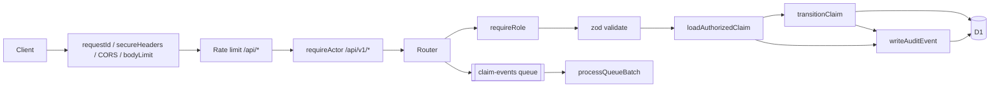

# EasyClaim Backend Architecture

This document reflects the code on branch `cyber`. For the full route list see [../BACKEND_INVENTORY.md](../BACKEND_INVENTORY.md).

## Runtime

A single Cloudflare Worker (`backend/src/index.ts`) built with Hono. It exports:

- `fetch`: the HTTP API.
- `queue`: the consumer for the `claim-events` queue.

## Request pipeline

```
HTTP request
  │
  ├─ requestId()                    adds X-Request-Id; stored in c.var.requestId (used by audit)
  ├─ secureHeaders()                nosniff, frame options, HSTS, etc.
  ├─ cors()                         only origins listed in ALLOWED_ORIGINS; allows Content-Type, Authorization, X-Dev-Actor-Id/Role headers
  ├─ bodyLimit(64 KB)               413 payload_too_large
  ├─ rate limit  (/api/*)           RATE_LIMITER.limit({ key: cf-connecting-ip }) → 429
  ├─ requireActor (/api/v1/*)       resolveActor() → c.var.actor or 401   [src/security/actor.ts]
  │
  ├─ router (endpoints/*.ts)
  │    ├─ requireRole(...)          403 + audit authz.role_denied         [src/security/rbac.ts]
  │    ├─ validate('param'|'json')  strict zod → 400 validation_failed    [src/security/validation.ts]
  │    ├─ loadAuthorizedClaim()     ownership / insurer read → 404 + audit [src/security/claimAccess.ts]
  │    ├─ transitionClaim()         checkTransition() + conditional UPDATE → 403/409 + audit
  │    └─ writeAuditEvent()         INSERT into audit_events              [src/security/audit.ts]
  │
  ├─ notFound  → 404 {"error":"not_found"}
  └─ onError   → HTTPException <500 passes through; everything else is 500 {"error":"internal_error", requestId}
```



## Security modules (`backend/src/security/`)

| Module | Responsibility |
|---|---|
| `actor.ts` | `resolveActor(c)` is the single replaceable authentication seam. It fails closed. When `ALLOW_DEV_ACTOR_HEADERS=true` (local only) it trusts `X-Dev-Actor-Id` / `X-Dev-Actor-Role`. **This is not authentication.** |
| `rbac.ts` | `requireRole(...roles)`: function-level authorization. |
| `claimAccess.ts` | `loadAuthorizedClaim(c, id, 'read' \| 'owner-write')`: object-level authorization. It returns the same 404 for "missing" and "not yours". `transitionClaim()` applies stage changes through the state machine, using `UPDATE … WHERE id=? AND stage=?` to block replay and races. |
| `claimStateMachine.ts` | A pure transition table. Stages: `Draft, Submitted, Verified, Screening, Review, Decision, Paid, Info Needed, Appeal, Withdrawn, Expired` (title case, matching seed data and frontend types). ADMIN has no transitions. Decision→Paid is MANAGER-only. |
| `audit.ts` | `writeAuditEvent()`: an insert-only security event log, separate from console logs. |
| `validation.ts` | Strict zod schemas and a `validate()` wrapper that never echoes input values. |

Roles (`src/types.ts`): `CUSTOMER`, `ASSESSOR`, `MANAGER`, `ADMIN`. `INSURER_ROLES` = ASSESSOR, MANAGER.

## Bindings (`backend/wrangler.toml`)

| Binding | Type | Notes |
|---|---|---|
| `DB` | D1 (`easy-claim-db`) | Migrations in `backend/migrations/` |
| `CLAIM_EVENTS` | Queue producer + consumer (`claim-events`) | batch 10, timeout 5 s |
| `RATE_LIMITER` | Workers Rate Limiting | 100 requests / 60 s. Approximate and per-location by design |
| `ALLOWED_ORIGINS` | var | Empty by default |
| `ALLOW_DEV_ACTOR_HEADERS` | `.dev.vars` only | Local dev/testing |

## Data model (D1)

| Table | Columns | Source |
|---|---|---|
| `policies` | `id, user_id, plan_name, status` | `0001_init.sql` |
| `claims` | `id, user_id, policy_id, stage, status` + `category, cause_of_loss, incident_date, created_at, updated_at` | `0001_init.sql`, `0002_security.sql` |
| `audit_events` | `id, occurred_at, actor_id, actor_role, action, resource_type, resource_id, outcome (success\|denied\|failure), request_id, details(JSON)` | `0002_security.sql`. Triggers `audit_events_no_update` / `audit_events_no_delete` abort any UPDATE/DELETE |
| `evidence` | `id, claim_id, uploaded_by, storage_key, mime_type, size_bytes, sha256, created_at` | `0002_security.sql`. **Unused**; reserved for future upload/storage |

`claims.user_id` is the ownership link. `claims.stage` is only changed by `transitionClaim()` (and `initiate`, which inserts `Draft`). `claims.status` holds the decision outcome (`Pending`, `Approved`, `Rejected`, …) and is never client-settable.

## Queue flow

```
POST /claims/:id/submit        ──► CLAIM_EVENTS.send({event:'ClaimSubmitted', data:{claimId,timestamp}})
POST /claims/:id/evidence-ocr  ──► CLAIM_EVENTS.send({event:'ClaimEvidenceUploaded', ...})
                                     │
                                     ▼
                     processQueueBatch (src/endpoints/ocr.ts)
                     - zod-validates each message (untrusted)
                     - malformed → ack + warn (no infinite retry)
                     - known events → log (no OCR engine exists)
                     - exception → retry
```

The consumer logic is verified by `backend/test/queue.test.ts`. Under local `wrangler dev` the consumer was not observed to fire, both before and after the cyber changes, so it has not been verified live.

## Not present

These do not exist in the code:

- Authentication provider.
- Insurer workflow endpoints.
- File storage (R2).
- OCR/AI engine.
- Payouts.
- Notifications service.
- Configuration store.
- Tenant/organisation model.
- CI and Docker.
