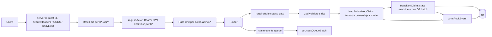

# EasyClaim Backend Architecture

This document reflects the code on branch `cyber`. For the full route list see [../BACKEND_INVENTORY.md](../BACKEND_INVENTORY.md).

**Phase 1 update (commit `cb2588a`, verified against the working tree on 2026-09-26):** the pipeline, security modules, bindings, data model and module map below were revised for bearer JWT authentication (`src/security/actor.ts`), the insurer tenant model (`migrations/0003_tenants.sql`, `src/security/claimAccess.ts`) and the insurer transition routes (`src/endpoints/claimsInsurer.ts`). Phase 0 statements that no longer hold are marked "Phase 1 update" rather than deleted. Design notes: [../phase-reports/PHASE_01_AUTH_FLOW.md](../phase-reports/PHASE_01_AUTH_FLOW.md), [../phase-reports/PHASE_01_TENANT_MODEL.md](../phase-reports/PHASE_01_TENANT_MODEL.md). Live evidence: [../phase-reports/evidence/PHASE_01_LIVE_ATTACKS.log](../phase-reports/evidence/PHASE_01_LIVE_ATTACKS.log).

## Runtime

A single Cloudflare Worker (`src/index.ts`) built with Hono. It exports:

- `fetch`: the HTTP API.
- `queue`: the consumer for the `claim-events` queue.

## Request pipeline

Phase 1 update: this is the order in `src/index.ts` and in the route files of the working tree (Phase 0 had one rate limit, a header-based actor stub and no tenant step).

```
HTTP request
  │
  ├─ request id (index.ts)          crypto.randomUUID(), generated server-side and never read from an inbound
  │                                 header; returned as X-Request-Id, stored in audit_events.request_id
  ├─ secureHeaders()                nosniff, frame options, HSTS, etc.
  ├─ cors()                         only origins listed in ALLOWED_ORIGINS; allowHeaders Content-Type, Authorization;
  │                                 allowMethods GET, POST, PATCH, OPTIONS
  ├─ bodyLimit(64 KB)               413 payload_too_large
  ├─ rate limit 1 (/api/*)          per client IP, BEFORE authentication:
  │                                 RATE_LIMITER.limit({ key: cf-connecting-ip }) → 429 rate_limited
  ├─ requireActor (/api/v1/*)       Authorization: Bearer <JWT> → hono/jwt verify(token, JWT_SECRET,
  │                                 { alg: 'HS256', iss: JWT_ISSUER, aud: JWT_AUDIENCE }) → validateClaims()
  │                                 → c.var.actor { id, role, tenantId }, or 401 {"error":"unauthenticated"}
  │                                 + WWW-Authenticate: Bearer (no audit row)         [src/security/actor.ts]
  ├─ rate limit 2 (/api/v1/*)       per actor, AFTER authentication, same binding:
  │                                 RATE_LIMITER.limit({ key: actor:<role>:<id> }) → 429
  │
  ├─ router (endpoints/*.ts)
  │    ├─ requireRole(...)          coarse, resource-independent gate (cannot leak whether a claim exists)
  │    │                            → 403 + audit authz.role_denied                  [src/security/rbac.ts]
  │    ├─ validate('param'|'json'|'query')  zod → 400 validation_failed; JSON body schemas are .strict()
  │    │                                    (unknown keys rejected), the GET /claims query schema validates
  │    │                                    limit only (other query parameters ignored)  [src/security/validation.ts]
  │    ├─ loadAuthorizedClaim(c, claimId, 'read' | 'owner-write' | 'insurer')
  │    │                            load → tenant boundary → ownership → mode; any failure → 404 not_found
  │    │                            + audit authz.claim_access_denied {mode, exists, reason}
  │    │                                                                            [src/security/claimAccess.ts]
  │    ├─ transitionClaim(c, claim, to, opts)
  │    │                            re-asserts owner / tenant (403 + audit transition_guard),
  │    │                            checkTransition() incl. per-transition role (403 forbidden / 409 illegal_transition,
  │    │                            audit claim.transition_rejected), then ONE D1 batch:
  │    │                              UPDATE claims SET stage[, status] ... WHERE id = ? AND stage = ?
  │    │                              INSERT INTO audit_events ... WHERE changes() = 1
  │    │                            0 rows changed → 409 stale_state (audited)
  │    └─ writeAuditEvent()         INSERT into audit_events with actor id, role, tenant and request id
  │                                                                                 [src/security/audit.ts]
  │
  ├─ notFound  → 404 {"error":"not_found"}
  └─ onError   → HTTPException <500 passes through; everything else is 500 {"error":"internal_error", requestId}
```

Route-level order on every resource route, as written in `claims.ts` / `claimsInsurer.ts`: `requireActor` (global) → `requireRole` → `validate` → `loadAuthorizedClaim` → `transitionClaim` → audit. Routers are mounted in `index.ts` under `/api/v1/client`, `/covers`, `/claims` (customer routes from `claims.ts`, then insurer routes from `claimsInsurer.ts` on the same prefix), `/ocr`, `/profile`, `/activities`.



## Security modules (`src/security/`)

| Module | Responsibility |
|---|---|
| `actor.ts` | `resolveActor(c)` / `requireActor` remain the single authentication seam and fail closed. Phase 0: a header stub behind `ALLOW_DEV_ACTOR_HEADERS` (not authentication). **Phase 1 update: IMPLEMENTED as app-verified bearer JWT.** `verify(token, JWT_SECRET, { alg: 'HS256', iss: JWT_ISSUER, aud: JWT_AUDIENCE })` from `hono/jwt` (any other `alg`, incl. `none`, is rejected), then `validateClaims()`: `exp` and `iat` required, `exp <= now` rejected, remaining lifetime capped by `MAX_TOKEN_TTL_SECONDS` (CUSTOMER 24 h; ASSESSOR/MANAGER/ADMIN 8 h), `sub` and `tenant_id` must match `ID_PATTERN`, `role` in `ROLES`, `tenant_id` required for ASSESSOR/MANAGER, forbidden for CUSTOMER, optional for ADMIN (DECISION REQUIRED). Missing `JWT_SECRET` (< 32 bytes), `JWT_ISSUER` or `JWT_AUDIENCE` → every request 401, logged as `auth misconfigured`. Logs carry only the hono error class name or a fixed `claims:<reason>` token, never the token; nothing is audited before authentication. The `X-Dev-Actor-*` stub and `ALLOW_DEV_ACTOR_HEADERS` are removed. Identity provider / JWKS (`verifyWithJwks`): PLANNED. Revocation / `jti` denylist: PLANNED. |
| `rbac.ts` | `requireRole(...roles)`: coarse function-level authorization, resource-independent so it cannot act as a cross-tenant existence oracle. 403 `forbidden` + audit `authz.role_denied`. |
| `claimAccess.ts` | `loadAuthorizedClaim(c, id, 'read' \| 'owner-write' \| 'insurer')`: object-level authorization. It returns the same 404 for "missing" and "not yours". **Phase 1 update:** decision order load → tenant boundary → ownership → mode; `isTenantInsurer()` = insurer role AND `actor.tenantId === claim.tenant_id` (non-null) AND `claim.stage !== 'Draft'`. Missing, another customer's, another tenant's, tenant-less and Draft claims all answer 404 and are audited as `authz.claim_access_denied` with `reason` `missing` / `not_owner` / `cross_tenant` / `tenant_unset` / `draft` / `role` / `mode`. `transitionClaim(c, claim, to, opts)` is the only code path that changes `claims.stage`: it re-asserts owner/tenant (`transition_guard`), applies the state machine incl. the per-transition role, then runs one D1 batch (conditional `UPDATE … WHERE id=? AND stage=?` + audit `INSERT … WHERE changes() = 1`) so replay and races give 409 `stale_state`; `opts.status` writes `claims.status` in the same statement (used by `/decide`). |
| `claimStateMachine.ts` | A pure transition table, **unchanged in Phase 1**. Stages: `Draft, Submitted, Verified, Screening, Review, Decision, Paid, Info Needed, Appeal, Withdrawn, Expired` (title case, matching seed data and frontend types). ADMIN has no transitions. Decision→Paid and Appeal→Review are MANAGER-only. Phase 1 update: every insurer edge, and every customer edge except Withdrawn, is reachable over HTTP; Withdrawn (CUSTOMER) and Expired (SYSTEM) are in the table but have no endpoint or job. |
| `audit.ts` | `writeAuditEvent()`: an insert-only security event log, separate from console logs. Phase 1 update: rows carry `actor_tenant_id` and the server-generated `request_id`; `auditStatement(c, event, { onlyIfPreviousChanged: true })` builds the `changes() = 1`-gated insert that `transitionClaim` batches with its `UPDATE`. |
| `validation.ts` | Strict zod body schemas (`.strict()`, unknown keys → 400) and a `validate()` wrapper for `param` / `json` / `query` that never echoes input values. Phase 1 update: `decideSchema` (`outcome: 'Approved' \| 'Rejected'`, strict) and `listQuerySchema` (`limit` 1..50, default 20, coerced; not `.strict()`, so other query parameters are ignored rather than rejected). |

Roles (`src/types.ts`): `CUSTOMER`, `ASSESSOR`, `MANAGER`, `ADMIN`. `INSURER_ROLES` = ASSESSOR, MANAGER.

Phase 1 update: the actor is `Actor { id, role, tenantId: string | null }`. Customers are platform-level (`tenantId` null; one customer holds policies with several insurers, see `seed_sa_data.sql`) and are authorized by ownership (`claims.user_id`). Insurer staff belong to exactly one tenant and are authorized by `claims.tenant_id`. ADMIN has no claim access and may omit `tenant_id` (DECISION REQUIRED: platform vs tenant admin). `ID_PATTERN` (`^[A-Za-z0-9_-]{1,64}$`) is shared by actor, tenant, claim and policy ids.

## Bindings, vars and secrets (`wrangler.toml`, `.dev.vars`)

| Binding | Type | Notes |
|---|---|---|
| `DB` | D1 (`easy-claim-db`) | Migrations in `migrations/` (`0001_init`, `0002_security`, `0003_tenants`) |
| `CLAIM_EVENTS` | Queue producer + consumer (`claim-events`) | batch 10, timeout 5 s |
| `RATE_LIMITER` | Workers Rate Limiting | 100 requests / 60 s. Approximate and per-location by design. Phase 1 update: applied twice on the same binding, per IP before authentication (`/api/*`) and per actor (`actor:<role>:<id>`) after it (`/api/v1/*`) |
| `ALLOWED_ORIGINS` | var (`[vars]`, `.dev.vars`) | Empty by default: no cross-origin browser access |
| `JWT_ISSUER` (Phase 1) | var (`[vars]` = `easyclaim-dev`; `.dev.vars` may override) | Expected `iss` claim; change per environment. Required: missing → every request 401 |
| `JWT_AUDIENCE` (Phase 1) | var (`[vars]` = `easyclaim-api`; `.dev.vars` may override) | Expected `aud` claim (string, or array containing it). Required: missing → every request 401 |
| `JWT_SECRET` (Phase 1) | **secret**, never in `wrangler.toml` | HS256 signing secret, at least 32 bytes. Locally in gitignored `.dev.vars` (written by `npm run setup:local`; `.dev.vars.example` holds the placeholder `CHANGE_ME`, which the server and the mint script both reject); deployed via `wrangler secret put JWT_SECRET`. Missing or short → every request 401, `auth misconfigured` logged |
| `ALLOW_DEV_ACTOR_HEADERS` (Phase 0 only) | Was a `.dev.vars`-only local flag (Phase 0) | Phase 0 local dev/testing flag for the `X-Dev-Actor-*` stub. **Phase 1 update: REMOVED** with the header stub; no code reads it and setting it has no effect |

`wrangler.toml` has no per-environment section (`[env.production]`): NOT IMPLEMENTED. Key rotation: NOT IMPLEMENTED. The `database_id` is a resource identifier, not a secret.

## Data model (D1)

| Table | Columns | Source |
|---|---|---|
| `tenants` (Phase 1) | `id, name` | `0003_tenants.sql`. The migration inserts the five demo insurers `ins_discovery`, `ins_sanlam`, `ins_outsurance`, `ins_momentum`, `ins_oldmutual` (`INSERT OR IGNORE`) |
| `policies` | `id, user_id, plan_name, status` + Phase 1 `tenant_id TEXT REFERENCES tenants(id)` | `0001_init.sql`, `0003_tenants.sql`. Indexes `idx_policies_user` (0002), `idx_policies_tenant` (0003) |
| `claims` | `id, user_id, policy_id, stage, status` + `category, cause_of_loss, incident_date, created_at, updated_at` + Phase 1 `tenant_id TEXT REFERENCES tenants(id)` | `0001_init.sql`, `0002_security.sql`, `0003_tenants.sql`. Indexes `idx_claims_user` (0002), `idx_claims_tenant` (0003) |
| `audit_events` | `id, occurred_at, actor_id, actor_role, action, resource_type, resource_id, outcome (success\|denied\|failure), request_id, details(JSON)` + Phase 1 `actor_tenant_id` | `0002_security.sql`, `0003_tenants.sql`. Triggers `audit_events_no_update` / `audit_events_no_delete` abort any UPDATE/DELETE (known open: a DB admin can drop them) |
| `evidence` | `id, claim_id, uploaded_by, storage_key, mime_type, size_bytes, sha256, created_at` | `0002_security.sql`. **Unused**; reserved for future upload/storage (evidence tenant isolation BLOCKED until it exists) |

`claims.user_id` is the ownership link. `claims.stage` is only changed by `transitionClaim()` (and `initiate`, which inserts `Draft`). `claims.status` holds the decision outcome (`Pending`, `Approved`, `Rejected`, …) and is never client-settable; Phase 1 update: `POST /claims/initiate` inserts it as `Pending`, and afterwards it is changed only by `POST /claims/:claimId/decide` through `transitionClaim({ status: outcome })`, in the same `UPDATE` as the stage change.

Phase 1 update, tenant links: `claims.tenant_id` is the insurer boundary for ASSESSOR/MANAGER and is copied from `policies.tenant_id` by `POST /claims/initiate` (never taken from the client; a policy without a tenant is not eligible, 422 `policy_not_eligible`, audited `policy_missing_tenant`). Migration 0003 backfills only the five seed policies by id (`pol_disc_001`, `pol_sanlam_002`, `pol_out_003`, `pol_mom_004`, `pol_oldm_005`) and their claims; any other pre-existing row keeps `tenant_id` NULL, which every insurer-side check treats as visible to no insurer. `seed_sa_data.sql` writes `tenant_id` directly. `audit_events.actor_tenant_id` records the acting tenant (NULL for customers) and `request_id` the server-generated id from `index.ts`.

## Queue flow

```
POST /claims/:id/submit        ──► CLAIM_EVENTS.send({event:'ClaimSubmitted', data:{claimId,timestamp}})
POST /claims/:id/evidence-ocr  ──► CLAIM_EVENTS.send({event:'ClaimEvidenceUploaded', ...})
                                     │
                                     ▼
                     processQueueBatch (src/endpoints/ocr.ts)
                     - zod-validates each message (untrusted)
                     - malformed → ack + warn (no infinite retry)
                     - known events → log (no OCR engine exists)
                     - exception → retry
```

The consumer logic is verified by `test/queue.test.ts`. Under local `wrangler dev` the consumer was not observed to fire, both before and after the cyber changes, so it has not been verified live. Phase 1 update: re-observed during the Phase 1 live run (no consumer log lines under `wrangler dev`); still NOT TESTED live.

## Module map (repository root)

| Path | Role |
|---|---|
| `src/index.ts` | App assembly: server-generated request id, `secureHeaders`, CORS, body limit, per-IP rate limit, `requireActor`, per-actor rate limit, router mounts, `notFound`, `onError`, and the `queue` export |
| `src/types.ts` | `ROLES`, `INSURER_ROLES`, `ID_PATTERN`, `Actor { id, role, tenantId }`, `Bindings` (incl. `JWT_SECRET`, `JWT_ISSUER`, `JWT_AUDIENCE`), `AppEnv` |
| `src/endpoints/gateway.ts` | `/client/*`: 4 demo-data routes |
| `src/endpoints/policy.ts` | `/covers/*`: 3 routes (`my-covers` scoped to the actor, static catalog, audited join request) |
| `src/endpoints/claims.ts` | Customer-side claim routes, 10 routes, incl. Phase 1 `GET /claims` (CUSTOMER → own claims; ASSESSOR/MANAGER → their tenant's claims excluding Draft, without `user_id`; ADMIN → 403 audited; `?limit` 1..50, default 20) |
| `src/endpoints/claimsInsurer.ts` (Phase 1) | Insurer transitions, 6 routes on the same `/claims` prefix: `POST /:claimId/verify`, `/screen`, `/review`, `/request-info`, `/decide` (`{ outcome }`), `/pay` (MANAGER-only via the state machine; 409 `not_approved` unless `status = 'Approved'`; state transition only, no payment execution). Each is `requireRole('ASSESSOR', 'MANAGER')` → `validate` → `loadAuthorizedClaim(…, 'insurer')` → `transitionClaim` |
| `src/endpoints/ocr.ts` | `POST /ocr/process` stub (insurer roles) and `processQueueBatch` |
| `src/endpoints/identity.ts` | `/profile/*`: 5 stubs (`GET /profile/mandates/:tenantId/check` ignores its parameter) |
| `src/endpoints/audit.ts` | `/activities/*`: 2 stubs; does not read `audit_events` |
| `src/models/policyModel.ts` | `PolicyModel.getMyCovers` (parameterised SQL) |
| `src/security/` | `actor.ts`, `rbac.ts`, `claimAccess.ts`, `claimStateMachine.ts`, `audit.ts`, `validation.ts` (table above) |
| `migrations/` | `0001_init.sql`, `0002_security.sql`, `0003_tenants.sql` (Phase 1) |
| `seed_sa_data.sql` | Demo policies and claims with `tenant_id`; users `user123` (Discovery, Sanlam, Old Mutual policies), `user456`, `user789` |
| `scripts/setup-dev-vars.mjs` (Phase 1) | `npm run setup:local`: creates `.dev.vars` from `.dev.vars.example` with a random 32-byte `JWT_SECRET`; never overwrites an existing file |
| `scripts/mint-token.mjs` (Phase 1) | `npm run token -- --demo \| --postman \| --sub X --role Y [--tenant Z] [--ttl s]`: local HS256 tokens signed with the `.dev.vars` secret (`iat` backdated 60 s; refuses claims the server would reject: role/tenant rules and TTL 60 s below the server maximum). `--postman` writes `postman/EasyClaim.local.postman_environment.json` (gitignored) |
| `test/` | vitest on `@cloudflare/vitest-plugin` (Workers runtime): 17 files, 264 passed on 2026-09-26 (after Phase 5); `helpers.ts` mints real HS256 tokens with the per-run random `JWT_SECRET` from `vitest.config.mts` |
| `wrangler.toml`, `.dev.vars.example` | Bindings and `[vars]` (`JWT_ISSUER`, `JWT_AUDIENCE`, `ALLOWED_ORIGINS`); the local settings template |
| `EasyClaim.postman_collection.json`, `postman/` | Postman collection (folders 0, 5, 6 and 7 are attack demos: 401 / 404 / 403 / 401) and its generated, gitignored environment |

## Not present

Phase 0 list, kept as written, with the Phase 1 state of each item:

- Authentication provider. Phase 1 update: the Worker verifies HS256 bearer tokens itself (IMPLEMENTED, `src/security/actor.ts`); an identity provider / JWKS verification (`hono/jwt` `verifyWithJwks`) is PLANNED, token revocation is PLANNED, key rotation and `[env.production]` config are NOT IMPLEMENTED.
- Insurer workflow endpoints. Phase 1 update: IMPLEMENTED as state transitions (`src/endpoints/claimsInsurer.ts`); decision records (amount, reason) NOT IMPLEMENTED; Withdrawn endpoint and Expired job NOT IMPLEMENTED; separation of duties (the same manager may decide and pay) and an appeal count limit are DECISION REQUIRED.
- File storage (R2). Unchanged: NOT IMPLEMENTED; evidence tenant isolation BLOCKED until an evidence resource exists.
- OCR/AI engine. Unchanged: NOT IMPLEMENTED.
- Payouts. Phase 1 update: PARTIAL; `POST /claims/:claimId/pay` is a MANAGER-only Decision → Paid transition that requires `status = 'Approved'`; no payment execution, no bank details.
- Notifications service. Unchanged.
- Configuration store. Unchanged.
- Tenant/organisation model. Phase 1 update: IMPLEMENTED (`tenants` table, `tenant_id` on policies and claims, tenant boundary in `claimAccess.ts`); tenant admin functions NOT IMPLEMENTED; per-tenant claimant reference and ADMIN scope DECISION REQUIRED.
- CI and Docker. Unchanged.
- Frontend/UI. Unchanged: `frontend/` holds only a zustand store and types.
