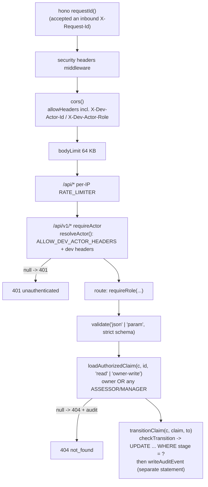
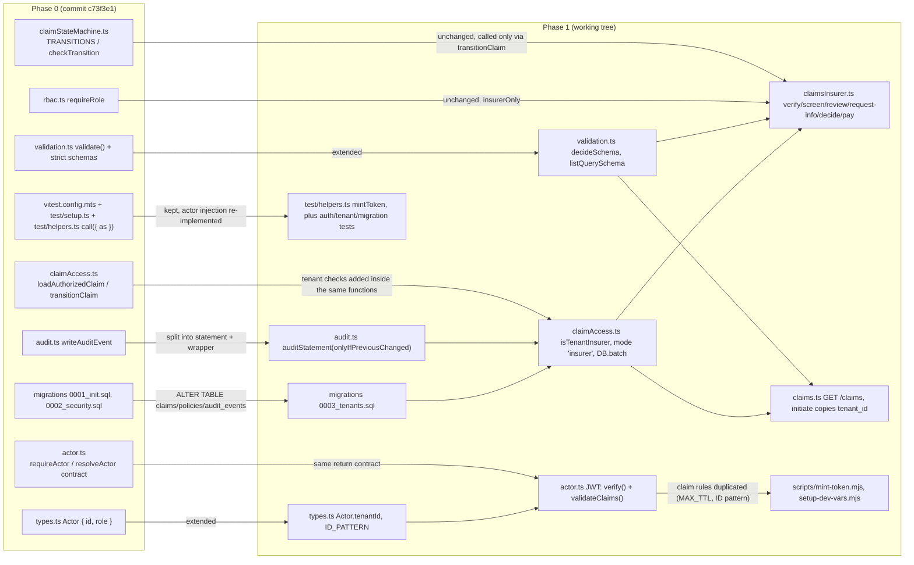
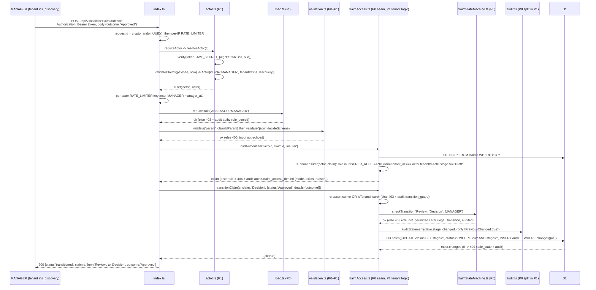

# Phase 0 to Phase 1: traceable security history

> Layout note: this report was recorded at commit `cb2588a`, when the Worker lived under `backend/`. The backend team later moved it to the repository root on `main`; on 2026-09-26 every path in this document was rewritten to that root layout (`backend/src/...` is now `src/...`).

Date: 2026-09-26
Branch: `cyber`
Phase 0 record: commits `c73f3e1` (implementation) and `1468897` (HEAD at the Phase 1 precheck), on top of `efb6cc3` (the `main` commit the branch was cut from).
Phase 1 state described here: commit `cb2588a` ("feat: complete phase 1 claims security and tenant flow"), which is `1468897` plus 51 files (36 modified, 15 added; see the appendix). This report was drafted against the then-uncommitted working tree; at the time of this check every backend file in the working tree (`src`, `migrations`, `test`, `scripts`, `package.json`, `wrangler.toml`) is identical to `cb2588a` (`git status` shows no change under `backend/`), while 17 documentation files carry further uncommitted edits (the Phase 1 documentation update in progress; listed in the appendix). `git merge-base main cyber` is `cb2588a`, so `main` already contains the commit.

Status vocabulary: IMPLEMENTED / PARTIAL / NOT IMPLEMENTED / PLANNED / BLOCKED / NOT TESTED / DECISION REQUIRED.

How this report was produced: every claim below was checked against the working tree (`src`, `migrations`, `test`, `scripts`, `wrangler.toml`) and against the `1468897` versions of the changed files (`git show 1468897:<path>`). `npx vitest run` was executed at the repository root at check time: **12 files, 183 passed, 1 todo** (an earlier draft of this report recorded 175 passed; the check-time run is authoritative and its per-file counts are in section 7). `npm run typecheck` (`tsc --noEmit`) exited 0 at check time. `npm audit` was not re-run for this report (its Phase 0 result is in `PHASE_01_PRECHECK.md` section 1).

The Phase 0 documents (`docs/security/README.md`, `docs/BACKEND_INVENTORY.md`, `docs/security/BACKEND_SECURITY_HANDOFF.md`, `docs/security/SECURITY_IMPLEMENTATION_PLAN.md` and the rest of `docs/security/`) are the Phase 0 record as committed at `1468897` (`git show 1468897:<path>` recovers that wording). This report reads them; it does not rewrite them. `cb2588a` and the Phase 1 documentation update edit those files in place (see the appendix), so the line numbers quoted in section 6 refer to the `1468897` versions unless stated otherwise.

---

## 1. What Phase 0 delivered

Phase 0 (branch `cyber`, commit `c73f3e1`) turned a stub API with one control (parameterised SQL in `PolicyModel.getMyCovers`, `src/models/policyModel.ts`) into an API with authorization, validation and audit, but **without authentication**. Its own summary is `docs/security/README.md` (posture table) and `docs/BACKEND_INVENTORY.md` section 2 (before/after table).

| Area | Phase 0 status (as recorded) | Phase 0 mechanism |
|---|---|---|
| Authentication | NOT IMPLEMENTED (dev stub only) | `src/security/actor.ts` `resolveActor()` trusted `X-Dev-Actor-Id` / `X-Dev-Actor-Role` only when `ALLOW_DEV_ACTOR_HEADERS === 'true'`; otherwise every `/api/v1/*` request got 401 |
| Function-level authorization | IMPLEMENTED | `src/security/rbac.ts` `requireRole(...roles)` with audit `authz.role_denied` |
| Object-level authorization | IMPLEMENTED (owner or *any* insurer) | `src/security/claimAccess.ts` `loadAuthorizedClaim(c, id, 'read' \| 'owner-write')`; deny and missing both 404 with audit `authz.claim_access_denied` `{mode, exists}` |
| Tenant scoping | NOT IMPLEMENTED | no tenant column, no `tenantId` on `Actor` |
| Property-level authorization | IMPLEMENTED | `src/security/validation.ts` strict zod schemas + `validate()` |
| Claim state machine | IMPLEMENTED (customer edges reachable; insurer edges had no routes) | `src/security/claimStateMachine.ts` `TRANSITIONS`, `checkTransition()`; `transitionClaim()` did a conditional `UPDATE ... WHERE id = ? AND stage = ?` **then** a separate audit INSERT |
| Audit trail | IMPLEMENTED | `src/security/audit.ts` `writeAuditEvent()`; `migrations/0002_security.sql` `audit_events` with `BEFORE UPDATE` / `BEFORE DELETE` triggers |
| Rate limiting | IMPLEMENTED (approximate, per IP) | `src/index.ts` `/api/*` middleware keyed on `cf-connecting-ip`; `wrangler.toml` `[[ratelimits]]` 100 / 60 s |
| Headers, CORS allowlist, 64 KB body limit, generic errors | IMPLEMENTED | `src/index.ts` |
| Queue message validation | IMPLEMENTED | `src/endpoints/ocr.ts` `processQueueBatch()` zod schema |
| Evidence upload, OCR/AI, decision records, payouts, config audit | NOT IMPLEMENTED | `evidence` table created in `0002_security.sql` but unused |
| Tests | 9 files, 85 tests | `test/*.test.ts`, `vitest.config.mts`, `test/setup.ts`, `test/helpers.ts` |

Phase 0 request pipeline at `1468897` (real middleware order from `src/index.ts` at that commit):

Phase 0 handed the rest to the backend team as `BACKEND-SEC-001` to `BACKEND-SEC-014` in `docs/security/BACKEND_SECURITY_HANDOFF.md`, and as the P0/P1 tables in `docs/security/SECURITY_IMPLEMENTATION_PLAN.md`.

---

## 2. What Phase 1 inherited

### 2.1 The seams Phase 0 built for Phase 1

Phase 0 deliberately concentrated the decisions Phase 1 would have to change into a few functions. These are the contracts Phase 1 built on rather than replaced:

| Seam (Phase 0) | Contract | How Phase 1 used it |
|---|---|---|
| `requireActor` / `resolveActor()` in `actor.ts` | return an `Actor` or `null`; everything downstream depends only on the returned `Actor` | body of `resolveActor()` replaced with JWT verification; `requireActor` kept, with one addition: its 401 now carries `WWW-Authenticate: Bearer realm="easyclaim"` (the Phase 0 version returned the bare 401) |
| `Actor` in `types.ts` | `{ id, role }` | extended to `{ id, role, tenantId: string \| null }` |
| `loadAuthorizedClaim()` in `claimAccess.ts` | single object-level gate for every `:claimId` route; null means 404 | tenant boundary and `'insurer'` mode added inside it; callers unchanged |
| `transitionClaim()` in `claimAccess.ts` | the only code that changes `claims.stage`; conditional UPDATE | tenant re-check, `opts.status`, and the atomic `DB.batch` added inside it |
| `TRANSITIONS` / `checkTransition()` in `claimStateMachine.ts` | pure transition table with per-edge roles | **unchanged**; Phase 1 insurer routes only call it through `transitionClaim()` |
| `requireRole()` in `rbac.ts` | coarse, resource-independent role gate | **unchanged**; reused as `insurerOnly` in `claimsInsurer.ts` |
| `validate()` + strict schemas in `validation.ts` | 400 on unknown keys, no echo of input | two schemas added (`decideSchema`, `listQuerySchema`), `'query'` target added |
| `writeAuditEvent()` in `audit.ts` | insert-only rows with `request_id` | split into `auditStatement()` (batchable) + `writeAuditEvent()` (wrapper) |
| `migrations/0001_init.sql`, `0002_security.sql` | `claims`, `policies`, `audit_events`, `evidence` | `0003_tenants.sql` ALTERs these tables; the append-only triggers are untouched |
| `vitest.config.mts`, `test/setup.ts`, `test/helpers.ts`, `test/env.d.ts` | isolated D1 per test file, migrations + seed applied, `call({ as })` injects an actor | kept; `call({ as })` now mints a real HS256 token instead of setting dev headers, so the five Phase 0 test files that are unchanged since `1468897` (`bola`, `rbac`, `claimLifecycle`, `queue`, `stateMachine`) run against JWT auth without edits; `massAssignment.test.ts` was extended in `cb2588a` (client-supplied `tenantId` / `tenant_id` rejected with 400 on `PATCH /screening` and `POST /initiate`; `initiate` derives `tenant_id` from the policy) with its Phase 0 assertions kept |

### 2.2 The open items Phase 1 inherited

From `BACKEND_SECURITY_HANDOFF.md`: BACKEND-SEC-001 (auth), 002 (tenant scoping), 003 (insurer endpoints), 005 (decision record), 006 (payout protections), 007 (evidence upload), 008 (OCR/AI as untrusted signal), 009 (config audit), 010 (actor-scoped stubs), 011 (queue consumer under `wrangler dev`), 012 (per-user rate limits), 013 (atomic audit writes), 014 (CI). From `docs/security/AUDIT_SECURITY.md` and `THREAT_MODEL.md`: audit triggers can be dropped by a D1 admin (accepted risk). From `BACKEND_INVENTORY.md` section 6: rate limiting approximate; `mandates/:tenantId/check` has no object check.

### 2.3 Facts established by the precheck that shaped Phase 1

`docs/phase-reports/PHASE_01_PRECHECK.md` section 5 recorded the facts Phase 1 designed against: no tenant identifier anywhere; seed customer `user123` holds policies with three insurers (so customers are platform-level, not tenant members); `hono/jwt` `verify()` checks `exp`/`nbf`/`iat` only when present and does not require `sub` (so Phase 1 must require them itself); `Jwt*` error messages embed the raw token (so only `err.name` may be logged); `verifyWithJwks()` exists as the future IdP path; tests inject actors through `test/helpers.ts`.

---

## 3. Phase 0 remaining risks: what Phase 1 did with each

| Phase 0 risk (source) | Phase 0 status | Phase 1 status | Addressed by (working tree) | Tests |
|---|---|---|---|---|
| No real authentication (BACKEND-SEC-001; `docs/security/README.md` warning) | NOT IMPLEMENTED | **IMPLEMENTED** | `src/security/actor.ts`: `resolveActor()` parses `Authorization: Bearer <JWT>` (`BEARER_TOKEN` regex), `verify(token, JWT_SECRET, { alg: 'HS256', iss: JWT_ISSUER, aud: JWT_AUDIENCE })`, then `validateClaims()`; `requireActor` returns 401 + `WWW-Authenticate`. `src/types.ts` `Bindings.JWT_SECRET/JWT_ISSUER/JWT_AUDIENCE`. `wrangler.toml` `[vars]` `JWT_ISSUER`, `JWT_AUDIENCE`. `.dev.vars.example` `JWT_SECRET=CHANGE_ME`. `scripts/setup-dev-vars.mjs` (`npm run setup:local`), `scripts/mint-token.mjs` (`npm run token`). Dev header stub removed from `actor.ts`, `types.ts` and the CORS `allowHeaders` in `index.ts`. | `test/auth.test.ts` AUTH-001..014, `test/actor.test.ts` |
| Missing config must not open the API (implicit in SEC-001) | n/a | **IMPLEMENTED** (fail closed) | `resolveActor()` returns null when `JWT_SECRET` < `MIN_SECRET_BYTES` (32) or `JWT_ISSUER`/`JWT_AUDIENCE` is empty | AUTH-009, AUTH-010 |
| Insurer roles not tenant-scoped (BACKEND-SEC-002; README "any ASSESSOR/MANAGER can read any claim"; AUTHZ-15 BLOCKED) | NOT IMPLEMENTED | **IMPLEMENTED** | `migrations/0003_tenants.sql` (`tenants`, `policies.tenant_id`, `claims.tenant_id` with `REFERENCES tenants(id)`, `audit_events.actor_tenant_id`, backfill by seed policy id only, indexes). `src/types.ts` `Actor.tenantId`, `ID_PATTERN` (the `INSURER_ROLES` constant already existed in Phase 0 and is reused). `src/security/actor.ts` `validateClaims()` requires `tenant_id` for ASSESSOR/MANAGER, forbids it for CUSTOMER. `src/security/claimAccess.ts` `isTenantInsurer()` and the load -> tenant -> ownership -> mode order in `loadAuthorizedClaim()`, with deny reasons `missing / not_owner / cross_tenant / tenant_unset / draft / role / mode`. `src/endpoints/claims.ts` `POST /initiate` copies `policy.tenant_id` (422 `policy_not_eligible` when NULL); `GET /claims` scoped per owner / per tenant. `seed_sa_data.sql` sets `tenant_id`. | `test/tenant.test.ts` TENANT-001..007, `test/migration.test.ts` |
| Insurer workflow endpoints missing (BACKEND-SEC-003; STATE-10 BLOCKED) | NOT IMPLEMENTED | **IMPLEMENTED** | `src/endpoints/claimsInsurer.ts`: `POST /claims/:claimId/verify`, `/screen`, `/review`, `/request-info`, `/decide`, `/pay`; every route is `insurerOnly` -> `validate('param', claimIdParam)` -> `loadAuthorizedClaim(c, id, 'insurer')` -> `transitionClaim()`. No route writes `claims.stage` directly. Mounted in `index.ts` at `/api/v1/claims`. | `test/tenant.test.ts` STATE-001..006, RBAC-001/002 |
| Strict schemas on every new endpoint (BACKEND-SEC-004) | IMPLEMENTED for existing routes | **IMPLEMENTED** for the new ones | `src/security/validation.ts` `decideSchema` (`outcome: 'Approved' \| 'Rejected'`, `.strict()`), `listQuerySchema` (`limit` 1..50) | `test/tenant.test.ts` "decide rejects invalid or extra fields", TENANT-006 (`?limit=500` -> 400) |
| Per-user rate limits (BACKEND-SEC-012) | PARTIAL (per IP) | **PARTIAL** (per IP + per actor; still approximate; no stricter limits on expensive routes) | `src/index.ts`: second `/api/v1/*` middleware after `requireActor`, key `actor:<role>:<id>`, same `RATE_LIMITER` binding | `test/hardening.test.ts` "rate limits per IP before auth and per actor after auth" |
| Audit write not atomic with the stage update (BACKEND-SEC-013; `AUDIT_SECURITY.md` gaps) | PARTIAL (sequential) | **IMPLEMENTED** | `src/security/audit.ts` `auditStatement(c, event, { onlyIfPreviousChanged: true })` builds `INSERT ... SELECT ... WHERE changes() = 1`; `claimAccess.ts` `transitionClaim()` runs `c.env.DB.batch([update, audit])`, and a 0-row result is audited as `claim.transition_rejected` `stale_state` | `test/audit.test.ts` "a stage-change audit row is written only when the stage change applied (same transaction)", STATE-001 |
| Keep tests green (BACKEND-SEC-014) | IMPLEMENTED locally; CI NOT IMPLEMENTED | **IMPLEMENTED locally** (12 files, 183 passed, 1 todo at check time); CI still **NOT IMPLEMENTED** | `test/*.test.ts` | this report's run (section 7) |
| Decision record (BACKEND-SEC-005) | NOT IMPLEMENTED | **NOT IMPLEMENTED** (outcome only) | `/decide` writes the outcome into `claims.status` through `transitionClaim(..., { status: outcome, details: { outcome } })`; no `decisions` table, no reason, amount, rules/model version or evidence hashes | STATE-001, STATE-005 cover the outcome path only |
| Payout protections (BACKEND-SEC-006) | NOT IMPLEMENTED | **PARTIAL** (state transition only, no payment) | `/pay` in `claimsInsurer.ts`: `checkTransition()` (MANAGER-only edge), then `claim.status !== 'Approved'` -> 409 `not_approved` (audited), then `transitionClaim(c, claim, 'Paid')` (conditional UPDATE means a replay gets 409). No idempotency key, destination verification, step-up auth, second approver or `payout.*` events. | STATE-003, STATE-004, STATE-005 |
| Evidence upload / storage / hashing (BACKEND-SEC-007; EVID-02..06) | NOT IMPLEMENTED | **NOT IMPLEMENTED** (unchanged) | `POST /claims/:claimId/evidence-ocr` still only queues an event; `evidence` table unused | `test/tenant.test.ts` TENANT-004 is `it.todo` (**BLOCKED**) |
| OCR/AI as untrusted signal (BACKEND-SEC-008) | NOT IMPLEMENTED | **NOT IMPLEMENTED** (unchanged) | `src/endpoints/ocr.ts` unchanged | `test/queue.test.ts` |
| Configuration change audit (BACKEND-SEC-009) | NOT IMPLEMENTED | **NOT IMPLEMENTED** | no config exists | none |
| Stubs not actor-scoped (BACKEND-SEC-010; `mandates/:tenantId/check` unscoped) | stubs | **NOT IMPLEMENTED** (unchanged) | `src/endpoints/identity.ts`, `gateway.ts`, `audit.ts` unchanged; `GET /profile/mandates/:tenantId/check` still ignores `tenantId` | none |
| Queue consumer does not fire under `wrangler dev` (BACKEND-SEC-011) | NOT TESTED (Phase 0 runtime observation) | **NOT TESTED live** (unchanged) | `processQueueBatch()` unchanged | `test/queue.test.ts` (unit only) |
| Audit triggers droppable by D1 admin (`AUDIT_SECURITY.md`, `THREAT_MODEL.md`) | accepted risk; mitigation NOT IMPLEMENTED | **NOT IMPLEMENTED** (unchanged; still an accepted risk) | `0002_security.sql` triggers untouched; `0003_tenants.sql` adds a column, no new protection | `test/audit.test.ts` "audit rows cannot be updated or deleted" |
| Rate limiting approximate (`BACKEND_INVENTORY.md` section 6) | PARTIAL (approximate by design of the binding) | **PARTIAL** (unchanged; approximate by design) | `wrangler.toml` `[[ratelimits]]` unchanged | `test/hardening.test.ts` |

Phase 1 changes that were not a listed Phase 0 risk but tightened Phase 0 behaviour:

- `src/index.ts`: the hono `requestId()` middleware (which reuses an inbound `X-Request-Id` header if it is well-formed) was replaced by a middleware that always sets `crypto.randomUUID()`, because the id is persisted in `audit_events.request_id`.
- `src/endpoints/claims.ts` `PATCH /:claimId/screening`: the UPDATE now repeats the stage precondition (`AND stage IN ('Draft', 'Info Needed')`) and returns 409 when 0 rows change.
- `src/endpoints/claims.ts` `GET /:claimId/timeline`: a stage counts as completed when the audit trail shows it was reached, so side-path history is not lost.
- `src/security/audit.ts` writes `actor_tenant_id` on every row; `test/audit.test.ts` also asserts no `Bearer` / `eyJ` substrings in audit rows.
- `EasyClaim.postman_collection.json` rewritten for bearer tokens (it keeps one negative-case request, "GET my-covers with retired X-Dev-Actor headers", that sends the retired headers without a token); generated `*.postman_environment.json` files are gitignored (`.gitignore`, `.gitignore`).

Decisions Phase 1 left explicitly open (marked in code):

- `src/types.ts`, `actor.ts` `validateClaims()`: ADMIN may carry or omit `tenant_id` — **DECISION REQUIRED** (platform admin vs tenant admin). Today ADMIN has no claim access either way (`test/tenant.test.ts` TENANT-001b, RBAC-002).
- `src/endpoints/claims.ts` `GET /claims` (insurer branch): `user_id` is a platform-wide customer id and is not returned to tenant staff — **DECISION REQUIRED** (per-tenant claimant reference).
- `src/security/actor.ts` header comment: no revocation list; bounded TTL (`MAX_TOKEN_TTL_SECONDS`) and secret rotation are the compensating controls. External identity provider through `hono/jwt` `verifyWithJwks` is **PLANNED** (documented only, no code path).

---

## 4. What remains open after Phase 1

| Item | Status | Where it would go |
|---|---|---|
| Decision record with reason/amount/versions (BACKEND-SEC-005) | NOT IMPLEMENTED | new table written in the same `DB.batch` as the `Review -> Decision` transition; `GET /claims/:claimId/decision` should read it |
| Payout execution and protections beyond the state machine (BACKEND-SEC-006) | PARTIAL | `/pay` in `claimsInsurer.ts` plus idempotency, destination, step-up, dual approval |
| Evidence upload, storage, hashing, tenant-scoped download (BACKEND-SEC-007; TENANT-004) | NOT IMPLEMENTED / BLOCKED | R2 binding + `evidence` table; `loadAuthorizedClaim()` already gives the tenant/owner gate |
| OCR/AI output as untrusted signal (BACKEND-SEC-008) | NOT IMPLEMENTED | `ocr.ts`; must never call `transitionClaim()` |
| Configuration versioning and audit (BACKEND-SEC-009) | NOT IMPLEMENTED | — |
| Actor-scoped profile / client / activities stubs; `mandates/:tenantId/check` object check (BACKEND-SEC-010) | NOT IMPLEMENTED | `identity.ts`, `gateway.ts`, `audit.ts` |
| Queue consumer under `wrangler dev` (BACKEND-SEC-011) | NOT TESTED live | — |
| Stricter limits on expensive routes; exact accounting (BACKEND-SEC-012) | PARTIAL | `index.ts`; the binding is approximate by design |
| CI running `npm test`, `npm run typecheck`, `npm audit` (BACKEND-SEC-014) | NOT IMPLEMENTED | — |
| Audit triggers droppable by a D1 admin | NOT IMPLEMENTED (accepted risk) | operational: restrict account access, periodic export |
| Token revocation / logout events | NOT IMPLEMENTED | compensated by TTL caps in `MAX_TOKEN_TTL_SECONDS` |
| ADMIN tenant semantics; per-tenant claimant reference | DECISION REQUIRED | `types.ts`, `actor.ts`, `claims.ts` |
| Read endpoint for auditors (`GET /activities/audit-trail` in `src/endpoints/audit.ts` returns `{ trail: [] }`) | NOT IMPLEMENTED | `audit.ts` endpoint |

---

## 5. Dependencies between the phases

### 5.1 Structural dependencies

Concretely:

1. **Phase 1 authentication depends on the Phase 0 `requireActor` seam.** Phase 0 wrote `resolveActor()` as "the single function to replace with real auth" (`BACKEND_SECURITY_HANDOFF.md`, row `actor.ts`). Phase 1 replaced its body and kept the `Actor | null` contract, so `requireRole`, `loadAuthorizedClaim`, `transitionClaim` and `writeAuditEvent` did not need to know how the actor was produced.
2. **Phase 1 tenant checks depend on the Phase 0 `loadAuthorizedClaim` / `transitionClaim` seams.** No new authorization gate was added. `isTenantInsurer()` is evaluated inside `loadAuthorizedClaim()` (so every `:claimId` route, Phase 0 or Phase 1, gets the tenant boundary) and again inside `transitionClaim()` (so a stage change cannot bypass it). Phase 0's "deny and missing both return 404" rule is what makes cross-tenant and non-existent claims indistinguishable (`test/tenant.test.ts` TENANT-003b).
3. **Phase 1 insurer routes depend on the Phase 0 state machine and role gate unchanged.** `src/security/claimStateMachine.ts` and `src/security/rbac.ts` are unchanged between `1468897` and `cb2588a` (not in the change set). `claimsInsurer.ts` never calls `checkTransition()` to change state; it calls it once in `/pay` only to order the `not_approved` precondition after the role/legality check, and then still goes through `transitionClaim()`.
4. **Phase 1 atomic audit depends on the Phase 0 `audit_events` table and triggers.** `auditStatement()` inserts into the `0002_security.sql` table; `0003_tenants.sql` only adds `actor_tenant_id`. The `WHERE changes() = 1` gate relies on the UPDATE being the immediately preceding statement in the same `DB.batch`.
5. **`0003_tenants.sql` depends on `0001_init.sql` and `0002_security.sql`** (it ALTERs `policies`, `claims` and `audit_events`), and `seed_sa_data.sql` now depends on `0003_tenants.sql` (the seed's `tenant_id` values must satisfy the foreign key to `tenants`, which the migration pre-populates with `INSERT OR IGNORE`).
6. **Phase 1 tests depend on the Phase 0 vitest setup.** `vitest.config.mts` (`cloudflareTest` plugin, `readD1Migrations`, seed SQL as a binding) is Phase 0 work with one edit (test-only `JWT_SECRET` / `JWT_ISSUER` / `JWT_AUDIENCE` miniflare bindings replace `ALLOW_DEV_ACTOR_HEADERS`); `test/setup.ts` (`applyD1Migrations` + seed per test file) and `test/env.d.ts` are unchanged since `1468897`. `test/helpers.ts` kept the Phase 0 `call({ as })` signature and the Phase 0 aliases `assessor` / `manager` (now pointing at the tenant A staff `assessorA` / `managerA`), which is why `bola.test.ts`, `rbac.test.ts`, `claimLifecycle.test.ts`, `queue.test.ts` and `stateMachine.test.ts` are unchanged since `1468897` and still pass; `massAssignment.test.ts` was extended for `tenant_id` (see 2.1) and also passes. `migration.test.ts` depends on `TEST_MIGRATIONS` exposing the raw `0003` statements. `test/tenant.test.ts` builds on Phase 0 helpers `createReadyDraft()` (extended with `createSubmittedClaim()`).
7. **`scripts/mint-token.mjs` duplicates rules from `actor.ts`** (`ROLES`, `ID` pattern, `MAX_TTL`, the tenant/role rule) so it refuses to mint a token the server would reject. This is a maintenance coupling: a change to `validateClaims()` must be mirrored in the script or `npm run token` will mint tokens that the API rejects (or refuse tokens the API would accept).

### 5.2 One insurer request end to end (Phase 0 and Phase 1 parts labelled)

---

## 6. Phase 0 documentation discrepancies and how they are handled

`docs/phase-reports/PHASE_01_PRECHECK.md` section 3 found three discrepancies in the Phase 0 documents. All three are wording; none was a code claim. The Phase 0 wording is preserved in git history at `1468897` (the line numbers below refer to that version); the working-tree copies of the three files carry the corrected wording as of this check (the Phase 1 documentation update edits the Phase 0 documents in place rather than adding parallel files), and this report keeps the history of what was wrong.

| # | Location (Phase 0 record at `1468897`) | Problem | Correct statement | Handling |
|---|---|---|---|---|
| D1 | `docs/security/README.md` line 22 | "Decisions / payouts — NOT IMPLEMENTED — no endpoints", but a read-only `GET /claims/:claimId/decision` existed in Phase 0 (`claims.ts`), and `BACKEND_INVENTORY.md` / the root README already said PARTIAL | Phase 0: "no decision-making or payout endpoints; `GET /decision` is read-only". Phase 1 additionally adds `POST /decide` (outcome only) and `POST /pay` (state transition only) | corrected in place: the row now reads PARTIAL and names `POST /claims/:claimId/decide`, `POST /claims/:claimId/pay` and the read-only `GET /claims/:claimId/decision`; the Phase 0 text remains at `1468897` |
| D2 | `docs/security/ATTACK_SCENARIOS.md` line 56 | scenario 5 "Evidence tampering" cross-references BACKEND-SEC-008 (OCR/AI); evidence upload is BACKEND-SEC-007 | "See BACKEND-SEC-007" | corrected in place: now "See BACKEND-SEC-007 (Evidence upload)" with a note that it previously pointed at BACKEND-SEC-008 |
| D3 | `docs/security/SECURITY_IMPLEMENTATION_PLAN.md` line 15 | the P0 row label for claim state transitions uses the banned adjective as a control name | "Claim state transition enforcement" | corrected in place: the row is now labelled "Claim state transition enforcement" |

Also recorded by the precheck (section 4) and carried here so they are not lost:

- The Phase 0 mutation check reported "5 tests in `bola.test.ts` fail"; a whole-suite count would also include `rbac.test.ts` "admin has no claim-reading powers", so **6** would fail suite-wide. The `bola.test.ts`-only count of 5 is consistent with the file.
- `docs/security/SECURITY_TEST_PLAN.md` STATE-01 says "12 legal transitions allowed": that is the number of rows in the unit test, not the 18 legal edges in `TRANSITIONS`.
- The Phase 0 runtime observations (queue consumer not firing under `wrangler dev`; rate-limit burst 113 x 200 / 7 x 429) cannot be verified statically and remain NOT TESTED live: the Phase 1 live evidence (`docs/phase-reports/evidence/PHASE_01_LIVE_ATTACKS.log`, captured 2026-09-25 against `wrangler dev` by `docs/phase-reports/evidence/live-attacks.sh`) covers the ATTACK-P1 token, tenant, role and state-machine scenarios and contains no queue-consumer or rate-limit observation.

Phase 0 statements that were **correct when written but are superseded by Phase 1** (not discrepancies; listed in `PHASE_01_PRECHECK.md` section 5 "Everything that mentions the dev actor stub"): every reference to `X-Dev-Actor-*` / `ALLOW_DEV_ACTOR_HEADERS` in the root `README.md`, `docs/BACKEND_INVENTORY.md`, `docs/security/README.md`, `BACKEND_SECURITY_HANDOFF.md`, `SECURITY_IMPLEMENTATION_PLAN.md`, `SECURITY_TEST_PLAN.md`, `ATTACK_SCENARIOS.md`, `SECURITY_CHECKLIST.md`, `API_SECURITY_MATRIX.md`, `RBAC_MATRIX.md`, `THREAT_MODEL.md`, `docs/architecture/BACKEND_ARCHITECTURE.md`; the "9 files, 85 tests" counts; `AUDIT_SECURITY.md` and `BACKEND_ARCHITECTURE.md` describing `request_id` as coming from hono `requestId()` (Phase 1 generates it in `index.ts`); `AUDIT_SECURITY.md` listing `authz.claim_access_denied` details as `{mode, exists}` (Phase 1 adds `reason`); and the `BACKEND-SEC-002` wording `organization_id` (Phase 1 named the column `tenant_id`). These are handled by the Phase 1 documentation update, which edits the Phase 0 files in place and marks changed statements as "Phase 1 update" rather than deleting them (for example, `docs/security/AUDIT_SECURITY.md` now lists the `reason` values of `authz.claim_access_denied` and says `request_id` is generated in `index.ts`; `docs/security/README.md` line 13's "any ASSESSOR/MANAGER can read any claim" is replaced by the tenant-scoping row). Which of those files were updated in `cb2588a` and which still carry uncommitted edits at check time is listed in the appendix; the content of the in-progress edits was not re-verified by this report, and stale counts such as "175 passed" may still appear in them until that update lands.

The header comment of `migrations/0003_tenants.sql` points to `docs/phase-reports/PHASE_01_TENANT_MODEL.md`; that file was not present when this report was drafted and is now committed in `cb2588a`, so the reference resolves.

---

## 7. Verification evidence for this report

| Check | Result |
|---|---|
| `npx vitest run` at the repository root (check time) | Test Files 12 passed (12); Tests 183 passed, 1 todo (184) |
| Test files (tests per file from the same run) | `actor` 34, `audit` 6, `auth` 42, `bola` 10, `claimLifecycle` 7, `hardening` 9, `massAssignment` 14, `migration` 3, `queue` 1, `rbac` 7, `stateMachine` 30, `tenant` 20 + 1 todo |
| The single todo | `test/tenant.test.ts` TENANT-004 evidence resource isolation: BLOCKED, no evidence endpoint |
| Files unchanged between `1468897` and `cb2588a` that Phase 1 depends on | `src/security/claimStateMachine.ts`, `src/security/rbac.ts`, `src/endpoints/ocr.ts`, `identity.ts`, `gateway.ts`, `audit.ts`, `policy.ts`, `src/models/policyModel.ts`, `migrations/0001_init.sql`, `0002_security.sql`, `test/bola.test.ts`, `rbac.test.ts`, `claimLifecycle.test.ts`, `queue.test.ts`, `stateMachine.test.ts`, `test/setup.ts`, `test/env.d.ts` |
| `npm run typecheck` (check time) | `tsc --noEmit` exit 0 |
| `npm audit` | NOT TESTED in this report (Phase 0 value in `PHASE_01_PRECHECK.md` section 1: 0 vulnerabilities) |
| Live `wrangler dev` checks | NOT TESTED in this report; the only live evidence is `docs/phase-reports/evidence/PHASE_01_LIVE_ATTACKS.log` (2026-09-25, ATTACK-P1 scenarios), which was not re-run here |

---

## Appendix: Phase 1 change set

Committed in `cb2588a` (`git diff --name-status 1468897 cb2588a`, 51 files):

Modified (36): `.gitignore`, `README.md`, `.dev.vars.example`, `.gitignore`, `EasyClaim.postman_collection.json`, `package.json` (scripts `setup:local`, `secret`, `token`), `seed_sa_data.sql`, `src/endpoints/claims.ts`, `src/index.ts`, `src/security/actor.ts`, `src/security/audit.ts`, `src/security/claimAccess.ts`, `src/security/validation.ts`, `src/types.ts`, `test/actor.test.ts`, `test/audit.test.ts`, `test/hardening.test.ts`, `test/helpers.ts`, `test/massAssignment.test.ts`, `vitest.config.mts`, `wrangler.toml`, `docs/BACKEND_INVENTORY.md`, and 14 files under `docs/security/`: `API_SECURITY_MATRIX.md`, `ATTACK_SCENARIOS.md`, `AUDIT_SECURITY.md`, `BACKEND_SECURITY_HANDOFF.md`, `CLAIM_STATE_SECURITY.md`, `DECISION_SECURITY.md`, `PAYOUT_SECURITY.md`, `RBAC_MATRIX.md`, `README.md`, `SECURITY_CHECKLIST.md`, `SECURITY_IMPLEMENTATION_PLAN.md`, `SECURITY_REQUIREMENTS.md`, `SECURITY_TEST_PLAN.md`, `THREAT_MODEL.md`.

Added (15): `migrations/0003_tenants.sql`, `scripts/mint-token.mjs`, `scripts/setup-dev-vars.mjs`, `src/endpoints/claimsInsurer.ts`, `test/auth.test.ts`, `test/migration.test.ts`, `test/tenant.test.ts`, and `docs/phase-reports/` with `PHASE_00_TO_PHASE_01.md` (this report), `PHASE_01_AUTH_FLOW.md`, `PHASE_01_PRECHECK.md`, `PHASE_01_REPORT.md`, `PHASE_01_SECURITY_FLOW.md`, `PHASE_01_TENANT_MODEL.md`, `evidence/PHASE_01_LIVE_ATTACKS.log`, `evidence/live-attacks.sh`.

Not touched by `cb2588a`: `docs/architecture/BACKEND_ARCHITECTURE.md`, `docs/security/AI_SECURITY.md`, `docs/security/EVIDENCE_SECURITY.md`, and every backend file listed as unchanged in section 7.

Uncommitted in the working tree at check time (`git status --porcelain`, 17 files, all documentation; the Phase 1 documentation update in progress, not re-verified by this report): `README.md`, `docs/BACKEND_INVENTORY.md`, `docs/architecture/BACKEND_ARCHITECTURE.md`, `docs/phase-reports/PHASE_01_AUTH_FLOW.md`, `docs/phase-reports/PHASE_01_TENANT_MODEL.md`, and under `docs/security/`: `API_SECURITY_MATRIX.md`, `ATTACK_SCENARIOS.md`, `AUDIT_SECURITY.md`, `CLAIM_STATE_SECURITY.md`, `DECISION_SECURITY.md`, `PAYOUT_SECURITY.md`, `RBAC_MATRIX.md`, `README.md`, `SECURITY_CHECKLIST.md`, `SECURITY_REQUIREMENTS.md`, `SECURITY_TEST_PLAN.md`, `THREAT_MODEL.md` (plus this report once the corrections recorded in it are saved). No file under `backend/` has uncommitted changes.
