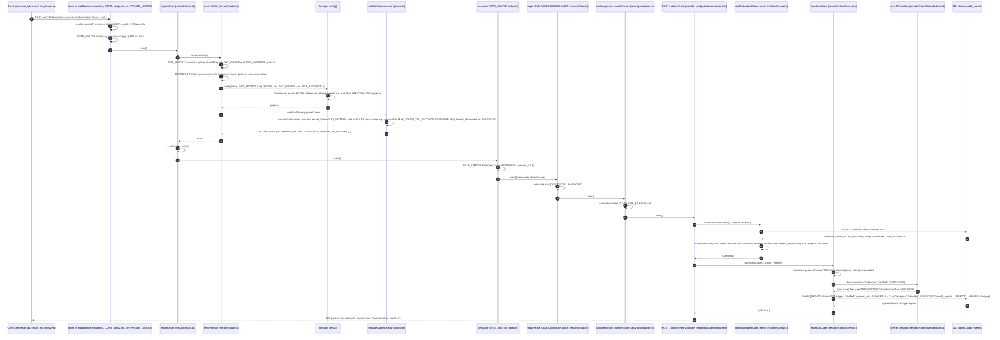
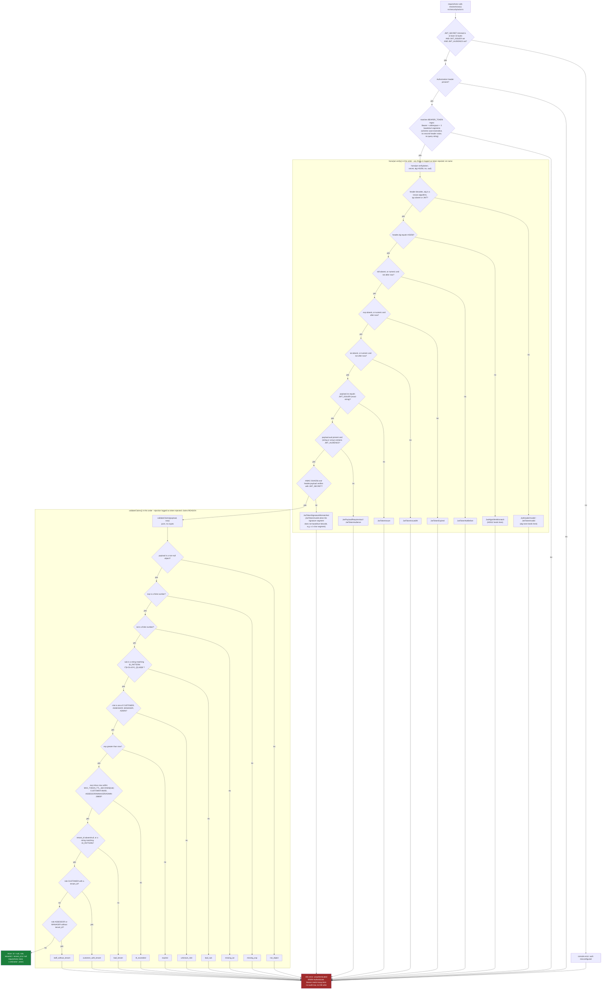

# Phase 1 Authentication and Authorization Flow

> Layout note: this report was recorded at commit `cb2588a`, when the Worker lived under `backend/`. The backend team later moved it to the repository root on `main`; on 2026-09-26 every path in this document was rewritten to that root layout (`backend/src/...` is now `src/...`).

Date: 2026-09-26
Branch: `cyber`, HEAD `cb2588a` ("feat: complete phase 1 claims security and tenant flow"). This report describes the working tree; at the time of writing `git status` shows no uncommitted changes under `src`, `migrations` or `test` (only files under `docs/` and `README.md` are modified), so the code described here is also what HEAD contains.
Backend: Cloudflare Worker, Hono 4.13.9, TypeScript, D1, Queue (repository root)
Test run at time of writing: `npx vitest run` at the repository root — 12 files, 183 passed, 1 todo (184)

Status summary:

| Area | Status | Where |
|---|---|---|
| Bearer JWT verification (HS256 pinned, iss/aud, exp/iat required, per-role TTL cap) | IMPLEMENTED | `src/security/actor.ts` — `resolveActor()`, `validateClaims()`, `requireActor` |
| Fail closed on missing configuration (every request 401) | IMPLEMENTED | `resolveActor()` first branch |
| Removal of the Phase 0 `X-Dev-Actor-*` header stub | IMPLEMENTED (no code path reads the headers or `ALLOW_DEV_ACTOR_HEADERS`) | verified: the only mention left in `src` is the removal note in the `actor.ts` doc comment; `test/auth.test.ts` AUTH-011, `test/actor.test.ts` |
| Actor with tenant (`Actor { id, role, tenantId }`) | IMPLEMENTED | `src/types.ts` |
| Tenant data model (`tenants`, `policies.tenant_id`, `claims.tenant_id`, `audit_events.actor_tenant_id`) | IMPLEMENTED | `migrations/0003_tenants.sql` |
| Object-level authorization by owner or tenant | IMPLEMENTED | `src/security/claimAccess.ts` — `loadAuthorizedClaim()`, `isTenantInsurer()` |
| Stage transition with per-transition role, conditional UPDATE and same-batch audit row | IMPLEMENTED | `claimAccess.ts` — `transitionClaim()`; `src/security/claimStateMachine.ts` — `checkTransition()` |
| Insurer routes `/verify`, `/screen`, `/review`, `/request-info`, `/decide`, `/pay` | IMPLEMENTED (state transitions only; `/pay` moves no money) | `src/endpoints/claimsInsurer.ts` |
| Token revocation, external IdP / JWKS, key rotation, login endpoint | NOT IMPLEMENTED | see section 5 |
| ADMIN: platform-level or tenant-level | DECISION REQUIRED | `types.ts` comment, `validateClaims()` accepts either |
| Evidence tenant isolation test (TENANT-004) | BLOCKED (no evidence endpoint) | `test/tenant.test.ts` `it.todo` |

Reading guide: every file, function, route, claim name, error string and audit action below exists in the working tree as named. Where a doc comment inside the code disagrees with the code, the code is what is described and the discrepancy is noted.

---

## 0. The chain in one line

```
Client → Authorization: Bearer <JWT> → hono/jwt verify() → validateClaims() → Actor { id, role, tenantId }
      → requireRole() (coarse role) → validate() (zod, strict) → loadAuthorizedClaim() (tenant / ownership / mode)
      → transitionClaim() (per-transition role, conditional UPDATE) → audit_events row (same D1 batch)
```

Middleware registration order in `src/index.ts` (top to bottom, all `app.use`):

1. `*` — server-generated `requestId` (`crypto.randomUUID()`), echoed as `X-Request-Id`
2. `*` — `secureHeaders()`, CORS allowlist (`allowHeaders: ['Content-Type', 'Authorization']`), `bodyLimit` 64 KiB → 413 `payload_too_large`
3. `/api/*` — per-IP rate limit, `RATE_LIMITER.limit({ key: cf-connecting-ip })` (key `'unknown'` when the header is absent) → 429 `rate_limited` (runs **before** authentication)
4. `/api/v1/*` — `requireActor` (the only authentication point; 401 on any failure)
5. `/api/v1/*` — per-actor rate limit, `RATE_LIMITER.limit({ key: 'actor:<role>:<id>' })` → 429 (runs **after** authentication, same binding)
6. `app.route('/api/v1/claims', claims)` then `app.route('/api/v1/claims', claimsInsurer)` and the other routers

No API route is registered outside `/api/v1/*` except the 404 handler, so no route is reachable without `requireActor`.

---

## 1. Successful insurer transition: `POST /api/v1/claims/:claimId/verify` by an ASSESSOR

Preconditions for the happy path shown: the token was signed with the Worker's `JWT_SECRET`, carries `role: "ASSESSOR"` and `tenant_id: "ins_discovery"`; the claim row has `tenant_id = 'ins_discovery'` and `stage = 'Submitted'`.



The audit row written in step 32 (built by `auditStatement()` in `src/security/audit.ts` with `onlyIfPreviousChanged: true`):

| column | value |
|---|---|
| `action` | `claim.stage_changed` |
| `actor_id` / `actor_role` / `actor_tenant_id` | `assessor_a1` / `ASSESSOR` / `ins_discovery` (from `c.get('actor')`) |
| `resource_type` / `resource_id` | `claim` / the claim id |
| `outcome` | `success` |
| `request_id` | the server-generated request id from step 2 |
| `details` | `{"from":"Submitted","to":"Verified"}` |

Because the INSERT is `... SELECT ... WHERE changes() = 1` and sits in the same D1 batch as the UPDATE, the audit row exists only if the UPDATE changed exactly one row. `test/audit.test.ts` ("a stage-change audit row is written only when the stage change applied (same transaction)" and the concurrent-submit test) exercises this.

### 1.1 Where the same request stops on failure

Same route, same order; the first failing step answers.

| Step (file) | Condition | Response | Audit row? |
|---|---|---|---|
| `bodyLimit` (`index.ts`) | body > 65 536 bytes | 413 `payload_too_large` | no |
| per-IP limiter (`index.ts`) | `RATE_LIMITER` denies | 429 `rate_limited` | no |
| `requireActor` (`actor.ts`) | any of the causes in section 2 | 401 `{"error":"unauthenticated"}` + `WWW-Authenticate: Bearer realm="easyclaim"` | no (AUTH-014: no pre-auth DB writes) |
| per-actor limiter (`index.ts`) | `RATE_LIMITER` denies for `actor:<role>:<id>` | 429 `rate_limited` | no |
| `requireRole('ASSESSOR','MANAGER')` (`rbac.ts`) | role is CUSTOMER or ADMIN | 403 `{"error":"forbidden"}` | yes: `authz.role_denied`, `resource_type = 'route'`, `resource_id = 'POST /api/v1/claims/:claimId/verify'` (`${c.req.method} ${c.req.routePath}`; `routePath` carries the prefix from `app.route('/api/v1/claims', ...)`) |
| `validate('param', claimIdParam)` (`validation.ts`) | `claimId` fails `ID_PATTERN` | 400 `validation_failed` with field paths, input never echoed | no |
| `loadAuthorizedClaim(..., 'insurer')` (`claimAccess.ts`) | claim missing, other tenant, `tenant_id` NULL, stage `Draft`, or actor not an insurer | 404 `{"error":"not_found"}` (indistinguishable from missing) | yes: `authz.claim_access_denied`, `details: { mode: 'insurer', exists, reason }` with reason one of `missing`, `not_owner`, `cross_tenant`, `tenant_unset`, `draft`, `role`, `mode` |
| `transitionClaim` guard (`claimAccess.ts`) | actor is neither owner nor tenant insurer (defence in depth; unreachable after a passing `loadAuthorizedClaim`) | 403 `forbidden` | yes: `authz.claim_access_denied`, `details.reason = 'transition_guard'` |
| `checkTransition` (`claimStateMachine.ts`) | edge not in `TRANSITIONS` (e.g. claim already `Review`) | 409 `illegal_transition` | yes: `claim.transition_rejected`, `details: { from, to, reason: 'illegal_transition' }` |
| `checkTransition` | edge exists but role not listed (e.g. ASSESSOR on `Decision → Paid`) | 403 `forbidden` | yes: `claim.transition_rejected`, `reason: 'role_not_permitted'` |
| conditional UPDATE (`claimAccess.ts`) | `meta.changes !== 1` (row moved between read and write) | 409 `stale_state` | yes: `claim.transition_rejected`, `reason: 'stale_state'` (written after the batch, outside it) |

Note on ordering inside `claimsInsurer.ts`: the code registers `insurerOnly` (the `requireRole` gate) **before** `validate('param', claimIdParam)` on every route (`router.post('/:claimId/verify', insurerOnly, validate('param', claimIdParam), ...)`). The file's own header comment lists validation as step 2 and the role gate as step 3, which is the reverse of the registered order. Documentation-only discrepancy; the behaviour described above is the code's. Customer routes in `claims.ts` use the same order (`requireRole('CUSTOMER')` then `validate(...)`).

Tests covering this path: `test/tenant.test.ts` STATE-001 (full `Submitted → … → Paid`, each step audited), STATE-002 (wrong tenant → 404), STATE-003 (assessor cannot pay → 403, audited), STATE-004 (illegal edges → 409), RBAC-001 (customer → 403, claim never loaded), RBAC-002 (admin cannot transition), AUDIT-001 (denials carry acting tenant / actor id).

---

## 2. `resolveActor()` and `validateClaims()` decision points (exact 401 causes)

Every path that does not reach the green node ends in `requireActor` returning `401 {"error":"unauthenticated"}` with `WWW-Authenticate: Bearer realm="easyclaim"`. The response body is identical for every cause (AUTH-012). Only the server log differs, and it never contains the token (AUTH-013).



Two things the diagram makes visible that are worth stating:

- `hono/jwt` `verify()` checks `nbf`/`exp`/`iat`/`iss`/`aud` **before** the signature. Every outcome is the same 401 and nothing is persisted, so the order does not change what a client can observe; it only changes which `Jwt*` class name appears in the log (an unsigned expired token logs `JwtTokenExpired`, not `JwtTokenSignatureMismatched`).
- `hono/jwt` validates `exp`, `iat` and `nbf` only when present and never requires `sub`. That is why `validateClaims()` separately requires `exp` and `iat` (`missing_exp`, `missing_iat`) and `sub` (`bad_sub`), and re-checks `exp <= now` (`expired`) on the verified payload with its own `now`.

Log lines emitted by `resolveActor()` (request id in brackets; nothing else):

| Cause | Log call | Text |
|---|---|---|
| misconfiguration | `console.error` | `[<requestId>] auth misconfigured: JWT_SECRET (>= 32 bytes), JWT_ISSUER and JWT_AUDIENCE are required` |
| no header / regex mismatch | none | silent `return null` |
| `verify()` threw | `console.warn` | `[<requestId>] token rejected: <err.name>` (e.g. `JwtTokenExpired`); a non-`Error` throw logs `unknown` |
| `validateClaims()` rejected | `console.warn` | `[<requestId>] token rejected: claims:<reason>` |

Tests: `test/auth.test.ts` AUTH-001 … AUTH-014 (no token, seven malformed header shapes, header parsing incl. query-string token, expired, wrong key, tampered payload, `alg: none`, HS512, unknown/missing role, missing exp/sub/iat/iss/aud, wrong iss/aud, future nbf/iat, TTL above 24 h and 8 h, customer with tenant, staff without tenant, `aud` array accepted, reuse after expiry, missing/short secret, missing iss/aud config, retired dev headers, opaque 401 body, token never logged, no pre-auth audit rows). `test/actor.test.ts` covers `actorFromClaims()` (the pure wrapper over `validateClaims()`) with 18 rejection cases and the exact-boundary TTL acceptances.

---

## 3. Token claims

Header and payload claims as the Worker reads them. "Where enforced" names the function; "Failure signal" is what reaches the log (the client always sees the same 401).

| Claim | Required? | Rule | Where enforced | Failure signal |
|---|---|---|---|---|
| header `alg` | yes | must be `HS256`; `none` and any other algorithm rejected | `hono/jwt verify()` called from `resolveActor()` with `alg: JWT_ALG` (`'HS256'`) | `JwtHeaderInvalid` (`none`), `JwtAlgorithmMismatch` (HS512 etc.) |
| header `typ` | no | if present must be `JWT` | `hono/jwt` `isTokenHeader()` | `JwtHeaderInvalid` |
| header `kid` | no | ignored; single secret, no key selection | — | — (NOT IMPLEMENTED, see section 5) |
| `iss` | yes | exact string equality with `JWT_ISSUER` | `hono/jwt verify()` (`iss: issuer`) | `JwtTokenIssuer` |
| `aud` | yes | string equal to, or array containing, `JWT_AUDIENCE` (AUTH-007 covers the array form) | `hono/jwt verify()` (`aud: audience`) | `JwtPayloadRequiresAud` (absent), `JwtTokenAudience` (no match) |
| `exp` | yes | finite number; `exp > now`; and `exp - now <= MAX_TOKEN_TTL_SECONDS[role]` (CUSTOMER 24 h; ASSESSOR, MANAGER, ADMIN 8 h) | presence and TTL cap: `validateClaims()`; `exp <= now` is checked twice: `hono/jwt` (when present) and `validateClaims()` | `missing_exp`, `expired`, `ttl_exceeded` (or `JwtTokenExpired` from hono first) |
| `iat` | yes | finite number; not in the future | presence: `validateClaims()`; `now < iat`: `hono/jwt` | `missing_iat`, `JwtTokenIssuedAt` |
| `nbf` | no | if present, numeric and `nbf <= now` | `hono/jwt` (only when present) | `JwtTokenNotBefore` |
| `sub` | yes | string matching `ID_PATTERN` `/^[A-Za-z0-9_-]{1,64}$/`; becomes `Actor.id` | `validateClaims()` | `bad_sub` |
| `role` | yes | exactly one of `ROLES` = `CUSTOMER`, `ASSESSOR`, `MANAGER`, `ADMIN` (case-sensitive); becomes `Actor.role` | `validateClaims()` | `unknown_role` |
| `tenant_id` | conditional | absent or `null` → `tenantId: null`; if present must match `ID_PATTERN`. Required for `ASSESSOR` and `MANAGER`; forbidden for `CUSTOMER`; optional for `ADMIN` (DECISION REQUIRED: platform vs tenant admin). Becomes `Actor.tenantId` | `validateClaims()` | `bad_tenant`, `customer_with_tenant`, `staff_without_tenant` |
| `jti` | no | not read; no replay or revocation check | — | — (NOT IMPLEMENTED) |
| any other claim | no | ignored; `Actor` carries only `id`, `role`, `tenantId` | — | — |

Interaction rule: the server applies **no clock-skew allowance**. `scripts/mint-token.mjs` compensates on the issuing side by backdating `iat` by 60 s and refusing a `--ttl` within 60 s of the role maximum; an external issuer must do the same or its tokens will fail `JwtTokenIssuedAt` / `ttl_exceeded` on a slightly-behind server. NOT TESTED against a real remote issuer.

---

## 4. Configuration

| Setting | Kind | Local `wrangler dev` | Tests (`vitest`) | Deployed | Read by |
|---|---|---|---|---|---|
| `JWT_SECRET` | **secret binding** (never a `[vars]` entry) | `.dev.vars` (gitignored). Created by `npm run setup:local` → `scripts/setup-dev-vars.mjs`, which writes `randomBytes(32).toString('hex')` and never overwrites an existing file. `.dev.vars.example` ships the placeholder `CHANGE_ME` | `vitest.config.mts` miniflare binding, a fresh `randomBytes(32).toString('hex')` on every run (no secret-shaped literal is committed) | `wrangler secret put JWT_SECRET` per environment | `resolveActor()` (trimmed, must be >= `MIN_SECRET_BYTES` = 32 bytes, else every request 401 and `auth misconfigured` logged); `scripts/mint-token.mjs` (refuses `CHANGE_ME` or < 32 bytes) |
| `JWT_ISSUER` | plain var | `wrangler.toml` `[vars]` → `"easyclaim-dev"`; may be overridden in `.dev.vars` | miniflare binding `'easyclaim-test'` | `wrangler.toml` `[vars]`, "change per environment" | `resolveActor()` → `verify({ iss })`; `mint-token.mjs` (`.dev.vars`, then `tomlVar('JWT_ISSUER')`) |
| `JWT_AUDIENCE` | plain var | `wrangler.toml` `[vars]` → `"easyclaim-api"` | miniflare binding `'easyclaim-api'` | `wrangler.toml` `[vars]` | `resolveActor()` → `verify({ aud })`; `mint-token.mjs` |
| `MAX_TOKEN_TTL_SECONDS` | code constant | `actor.ts` (`CUSTOMER: 86400`, staff and admin `28800`) | same | same | `validateClaims()`; mirrored as `MAX_TTL` in `mint-token.mjs` |
| `JWT_ALG`, `MIN_SECRET_BYTES` | code constants | `actor.ts` (`'HS256'`, `32`) | same | same | `resolveActor()` |
| `RATE_LIMITER` | Workers rate-limit binding (optional in `Bindings`) | `wrangler.toml` `[[ratelimits]]` `limit = 100`, `period = 60` | provided from `wrangler.toml` by the vitest plugin (`test/hardening.test.ts` "rate limit binding is configured"); individual tests replace it with a stub via `call({ env: { RATE_LIMITER } })` to force 429 or record keys | `wrangler.toml` | per-IP and per-actor limiters in `index.ts`; middleware passes through silently when the binding is absent |
| `ALLOWED_ORIGINS` | plain var | `wrangler.toml` `""`; `.dev.vars.example` sets `http://localhost:5173` | `'http://localhost:5173'` | `wrangler.toml` | CORS origin allowlist in `index.ts` (not part of authentication, but the CORS `allowHeaders` list must keep `Authorization`) |

Fail-closed behaviour (AUTH-009, AUTH-010): with `JWT_SECRET` unset, shorter than 32 bytes, or `JWT_ISSUER` / `JWT_AUDIENCE` empty, `resolveActor()` returns `null` before reading the header, so a correctly signed token is also rejected. Operators see `auth misconfigured` in the log; clients see the ordinary 401.

Local token minting (`npm run token` → `scripts/mint-token.mjs`): signs with `hono/jwt sign(payload, secret, 'HS256')`, payload `{ sub, role, iss, aud, iat: now - 60, exp: now + ttl }` plus `tenant_id` when given; `--demo` prints one token per entry in the script's `DEMO_ACTORS` list (`user123`, `user456`, `assessor_a1`/`manager_a1` in `ins_discovery`, `assessor_b1`/`manager_b1` in `ins_sanlam`, `admin1`; none of these ids is a row of its own: `seed_sa_data.sql` inserts only `policies` and `claims`, where `user123` and `user456` appear as `user_id` values; staff and admin ids exist only inside tokens, there is no `users` table); `--postman` writes a gitignored Postman environment (`postman/*.postman_environment.json`). The script applies the same claim-shape rules as `validateClaims()` (`ID` pattern for `sub`/`tenant`, `ROLES`, customer-without-tenant, staff-with-tenant, `MAX_TTL` cap), so a token minted with the `.dev.vars` secret and the `wrangler.toml` issuer/audience passes `validateClaims()`; the `--secret`, `--iss` and `--aud` overrides are not checked against the Worker's configuration and can still produce a token the server rejects. It is a local-only tool; there is no token-issuing endpoint in the Worker (section 5).

---

## 5. Not implemented, and the decision record

### 5.1 NOT IMPLEMENTED in Phase 1

| Item | Status | What exists instead / consequence |
|---|---|---|
| Token revocation / denylist | NOT IMPLEMENTED (PLANNED, handoff BACKEND-SEC-019) | No `jti` is read; no KV/D1 lookup in `resolveActor()`. A leaked or no-longer-wanted token stays valid until `exp` (at most 8 h staff, 24 h customer). Compensating controls: the TTL caps in `validateClaims()`, and replacing `JWT_SECRET`, which invalidates every outstanding token at once. |
| External identity provider / JWKS | NOT IMPLEMENTED (documented only; PLANNED, handoff BACKEND-SEC-019) | `hono/jwt` 4.13.9 ships `verifyWithJwks()` (asymmetric keys, `jwks_uri` or inline `keys`; it throws `JwtSymmetricAlgorithmNotAllowed` for HS*). Nothing in `src` calls it. See 5.2 for the migration path. |
| Signing-key rotation with overlap | NOT IMPLEMENTED (PLANNED, handoff BACKEND-SEC-019) | One secret, no `kid` handling, no previous-secret fallback. Rotation today is `wrangler secret put JWT_SECRET` with a new value → every existing token fails `JwtTokenSignatureMismatched` immediately (all sessions end). NOT TESTED as a procedure. |
| Login / token issuance endpoint, refresh tokens | NOT IMPLEMENTED | No `/auth/*` route exists. Tokens are minted out of band (`mint-token.mjs` locally). A deployed environment needs an issuer that is not in this repository. |
| User directory | NOT IMPLEMENTED | No `users` table in migrations `0001`–`0003`; `Actor` is entirely token-borne. A role change or deactivation cannot take effect before the token expires. |
| Server-side clock-skew tolerance | NOT IMPLEMENTED | See section 3; only the local mint script compensates. |
| MFA, device or IP binding, session limits | NOT IMPLEMENTED | Out of Phase 1 scope. |
| ADMIN tenant semantics | DECISION REQUIRED (handoff BACKEND-SEC-020) | `validateClaims()` accepts ADMIN with or without `tenant_id`; ADMIN has no claim access or transitions either way (`TRANSITIONS` has no ADMIN entry; `GET /claims` → 403; `loadAuthorizedClaim` reason `role`). TENANT-001b covers the "ADMIN with tenant still gets nothing" case. |
| Per-tenant claimant reference in the insurer list | DECISION REQUIRED (handoff BACKEND-SEC-017) | `GET /claims` for insurer staff omits `user_id` (platform-wide id) — `claims.ts` comment. |

### 5.2 Decision record: Option B — application-verified HS256 now, JWKS path later

**Status:** IMPLEMENTED (Option B) in Phase 1. The JWKS path is PLANNED and the choice of identity provider for it remains DECISION REQUIRED.

**Context.** Phase 0 identity came from `X-Dev-Actor-Id` / `X-Dev-Actor-Role` headers behind an `ALLOW_DEV_ACTOR_HEADERS` flag. `docs/security/BACKEND_SECURITY_HANDOFF.md` BACKEND-SEC-001 required `resolveActor()` to return verified identity and named two acceptable shapes: `hono/jwt` HS256 with pinned `alg`, `JWT_SECRET` via `wrangler secret put`, required `sub`/`role`/`exp`; or a managed IdP. No IdP had been selected, the tenant model (BACKEND-SEC-002) was being introduced in the same phase, and the `docs/phase-reports/PHASE_01_PRECHECK.md` section 5 probe of `hono/jwt` had established exactly which checks the library performs and which it leaves to the caller.

**Options considered in this record.**

| Option | Summary | Why not chosen now |
|---|---|---|
| A — managed IdP now | Issue asymmetric tokens from an external provider; verify with `verifyWithJwks()` | No provider chosen; role and `tenant_id` claim mapping would have to be agreed with it first; verification gains a network dependency (JWKS fetch) that the offline test suite cannot exercise without key fixtures; would have delayed the tenant-scoping and transition work that shares this phase |
| **B — app-verified HS256 now, JWKS later (chosen)** | Worker verifies HS256 tokens with a secret binding; all claim policy lives in `validateClaims()`; the library call is the only thing the JWKS path replaces | — |
| C — keep the header stub behind a flag until an IdP exists | Status quo | Fails BACKEND-SEC-001; a single misconfigured flag is a complete authentication bypass; every doc and test would keep describing a mechanism nobody intends to ship |

**Decision.** Option B, as implemented in `src/security/actor.ts`:
`verify(token, JWT_SECRET, { alg: 'HS256', iss: JWT_ISSUER, aud: JWT_AUDIENCE })` followed by `validateClaims()`; fail closed on missing configuration; `exp`, `iat`, `sub`, `role` required by the application because the library does not require them; per-role TTL caps; log only error class names or fixed reason tokens; no audit writes before authentication; the header stub deleted rather than disabled.

**Consequences accepted.**

- The `JWT_SECRET` holder is the trust anchor: whoever can sign can mint any role and tenant. The secret is therefore a secret binding only, never in `wrangler.toml`, generated at 32 random bytes, and shared only with the issuer.
- No revocation and no zero-downtime rotation (5.1). Bounded lifetimes are the compensating control.
- Symmetric verification means the API cannot accept tokens from a second issuer without sharing the secret; a second issuer is a trigger to move to A.
- Tests mint real tokens with a per-run random secret (`test/helpers.ts` `mintToken()`), so the suite exercises the real verification path rather than a stub.

**Migration path to JWKS (PLANNED, not scheduled).** What changes: the `verify()` call in `resolveActor()` becomes `verifyWithJwks(token, { jwks_uri, allowedAlgorithms }, ...)`, a `JWT_JWKS_URL` (var) replaces `JWT_SECRET` (secret), `kid` selection is handled by the library (`verifyWithJwks()` requires a `kid` header and matches it against the key set) but JWKS caching is not (`verifyWithJwks()` fetches `jwks_uri` on every call, so a cache has to be added), `role` and `tenant_id` are mapped from the provider's custom-claim names before `validateClaims()`, `mint-token.mjs` is retired for deployed environments, and tests need key fixtures (inline `keys`). What does not change: `validateClaims()`, `requireActor`, `Actor`, `requireRole`, `loadAuthorizedClaim`, `transitionClaim`, the audit schema, and every route. **Revisit triggers:** the first deployed environment with real users; a need for revocation or key rotation without a global logout; a second token issuer.

---

## 6. Test evidence by step

| Step | Tests (file: id or name) | Status |
|---|---|---|
| Header parsing and JWT verification | `auth.test.ts` AUTH-001, 002, 002b, 003, 004, 004b, 004c, 004d, 005, 005b, 007, 008, 012, 013 | IMPLEMENTED |
| Claim policy (`validateClaims`) | `auth.test.ts` AUTH-006, 006b, 006c; `actor.test.ts` `actorFromClaims` suite | IMPLEMENTED |
| Fail closed on configuration | `auth.test.ts` AUTH-009, AUTH-010 | IMPLEMENTED |
| Header stub removed | `auth.test.ts` AUTH-011; `actor.test.ts` "401 for the retired dev headers, with or without the old flag" | IMPLEMENTED |
| No pre-auth writes | `auth.test.ts` AUTH-014 | IMPLEMENTED |
| Rate limits per IP then per actor | `hardening.test.ts` "rate limits per IP before auth and per actor after auth", "returns 429 when the rate limiter denies the request" | IMPLEMENTED (binding is approximate by design) |
| Coarse role gate | `tenant.test.ts` RBAC-001, RBAC-002; `rbac.test.ts` "customer cannot call the insurer OCR endpoint", "insurer roles cannot use customer-only …" (4 cases) | IMPLEMENTED |
| Tenant boundary and ownership | `tenant.test.ts` TENANT-001, 001b, 001c, 002, 002b, 003, 003b, 005, 006, 007; `bola.test.ts` (10 cases); `rbac.test.ts` "admin has no claim-reading powers" (404 from `loadAuthorizedClaim`, reason `role`) | IMPLEMENTED |
| Evidence isolation | `tenant.test.ts` TENANT-004 `it.todo` | BLOCKED (no evidence endpoint or stored evidence) |
| Transition role, legality, staleness, same-batch audit | `tenant.test.ts` STATE-001 … 006, AUDIT-001; `audit.test.ts` (6 cases incl. concurrent submits); `claimLifecycle.test.ts` (7 cases); `stateMachine.test.ts` | IMPLEMENTED |
| Tenant migration backfill | `migration.test.ts` (3 cases) | IMPLEMENTED |
| Secret rotation procedure, remote issuer clock skew, JWKS path | none | NOT TESTED / NOT IMPLEMENTED |

---

## 7. Open items carried out of Phase 1

| Item | Status | Source |
|---|---|---|
| Evidence upload / storage, OCR, decision records with amounts and reasons, payout execution | NOT IMPLEMENTED (the handoff marks 005 and 006 PARTIAL because `/decide` writes `claims.status` and `/pay` is a MANAGER-only transition gated on `status = 'Approved'`; 007 and 008 NOT IMPLEMENTED) | handoff BACKEND-SEC-005 … 008; `claimsInsurer.ts` header comment; `/pay` is a stage change only |
| Audit append-only triggers (`migrations/0002_security.sql` `audit_events_no_update`, `audit_events_no_delete`) can be dropped by a database administrator | PARTIAL (triggers exist; no protection against a DB administrator) | `docs/security/AUDIT_SECURITY.md` "accepted risk" row |
| Queue consumer (`processQueueBatch`) under `wrangler dev` | NOT TESTED as a repeatable check. Handoff BACKEND-SEC-011 records that the consumer did fire once during the Phase 1 live run (dev-server log; that log line is not in `evidence/PHASE_01_LIVE_ATTACKS.log`), so the Phase 0 "does not fire" observation is intermittent rather than a code defect. Consumer logic is covered by `queue.test.ts` (1 case) | handoff BACKEND-SEC-011; `PHASE_01_PRECHECK.md` section 4 |
| Rate limiting approximate and per-location | PARTIAL (approximate by design) | `wrangler.toml` comment, `index.ts` comment, BACKEND-SEC-012 (now per-IP and per-actor) |
| Token revocation, key rotation, IdP/JWKS, login endpoint | NOT IMPLEMENTED / PLANNED | section 5 |
| ADMIN platform vs tenant; per-tenant claimant reference | DECISION REQUIRED | `types.ts`, `claims.ts` |

---

## Appendix: files and functions referenced

- `src/index.ts` — middleware chain (`requestId`, CORS, `bodyLimit`, per-IP `RATE_LIMITER`, `requireActor`, per-actor `RATE_LIMITER`), `app.route(...)`, `app.notFound`, `app.onError`
- `src/security/actor.ts` — `JWT_ALG`, `MIN_SECRET_BYTES`, `MAX_TOKEN_TTL_SECONDS`, `BEARER_TOKEN`, `resolveActor()`, `validateClaims()`, `ClaimRejectReason`, `actorFromClaims()`, `requireActor`
- `src/types.ts` — `ROLES`, `Role`, `INSURER_ROLES`, `ID_PATTERN`, `Actor`, `Bindings` (`JWT_SECRET`, `JWT_ISSUER`, `JWT_AUDIENCE`, `RATE_LIMITER`, `ALLOWED_ORIGINS`), `AppEnv`
- `src/security/rbac.ts` — `requireRole()`
- `src/security/validation.ts` — `validate()`, `claimIdParam`, `decideSchema`, `listQuerySchema`
- `src/security/claimAccess.ts` — `ClaimRow`, `ClaimAccessMode`, `isTenantInsurer()`, `loadAuthorizedClaim()`, `transitionClaim()`, `TransitionOutcome`, `TransitionOptions`
- `src/security/claimStateMachine.ts` — `CLAIM_STAGES`, `MAIN_PATH`, `TRANSITIONS`, `checkTransition()`, `isClaimStage()`
- `src/security/audit.ts` — `auditStatement()` (with `onlyIfPreviousChanged`), `writeAuditEvent()`
- `src/endpoints/claimsInsurer.ts` — `POST /:claimId/verify`, `/screen`, `/review`, `/request-info`, `/decide`, `/pay`; `insurerOnly`
- `src/endpoints/claims.ts` — `GET /status`, `GET /`, `POST /verify-eligibility`, `POST /initiate`, `PATCH /:claimId/screening`, `POST /:claimId/evidence-ocr`, `POST /:claimId/submit`, `GET /:claimId/timeline`, `GET /:claimId/decision`, `POST /:claimId/appeal`
- `migrations/0002_security.sql` — `audit_events_no_update`, `audit_events_no_delete` triggers
- `migrations/0003_tenants.sql` — `tenants`, `policies.tenant_id`, `claims.tenant_id`, `audit_events.actor_tenant_id`, backfill, indexes
- `wrangler.toml` — `[vars]` `JWT_ISSUER`, `JWT_AUDIENCE`, `ALLOWED_ORIGINS`; `[[ratelimits]]` `RATE_LIMITER`
- `.dev.vars.example`, `scripts/setup-dev-vars.mjs` (`npm run setup:local`), `scripts/mint-token.mjs` (`npm run token`), `package.json` scripts
- `vitest.config.mts` — miniflare bindings for tests
- `test/helpers.ts` (`mintToken()`, `call()`), `auth.test.ts`, `actor.test.ts`, `tenant.test.ts`, `bola.test.ts`, `rbac.test.ts`, `hardening.test.ts`, `audit.test.ts`, `claimLifecycle.test.ts`, `stateMachine.test.ts`, `migration.test.ts`, `massAssignment.test.ts`, `queue.test.ts`
- `node_modules/hono/dist/utils/jwt/jwt.js` (4.13.9) — `verify()`, `verifyWithJwks()`, `sign()`, `isTokenHeader()`; error classes (defined in `node_modules/hono/dist/utils/jwt/types.js`, each sets `this.name` to its class name, which is what `resolveActor()` logs) `JwtTokenInvalid`, `JwtHeaderInvalid`, `JwtAlgorithmMismatch`, `JwtTokenNotBefore`, `JwtTokenExpired`, `JwtTokenIssuedAt`, `JwtTokenIssuer`, `JwtPayloadRequiresAud`, `JwtTokenAudience`, `JwtTokenSignatureMismatched`, `JwtSymmetricAlgorithmNotAllowed`, `JwtHeaderRequiresKid`
- `docs/security/BACKEND_SECURITY_HANDOFF.md` (BACKEND-SEC-001, 002, 005 … 008, 011, 012, 013, 017, 019, 020), `docs/phase-reports/PHASE_01_PRECHECK.md` (sections 4 and 5), `docs/phase-reports/evidence/PHASE_01_LIVE_ATTACKS.log`
