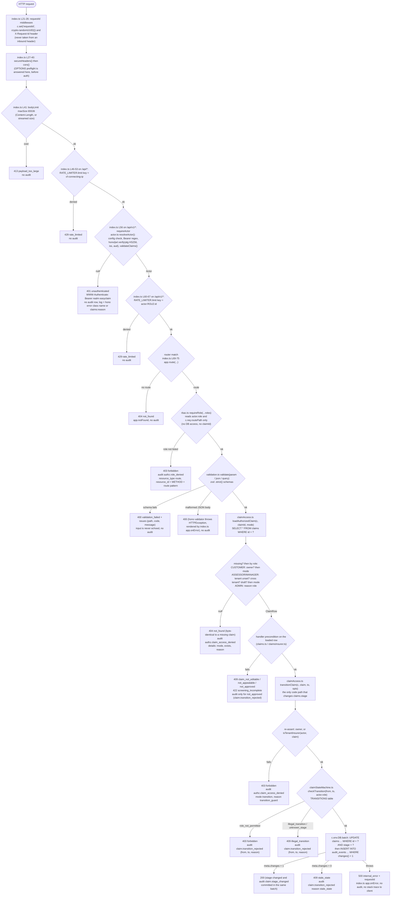
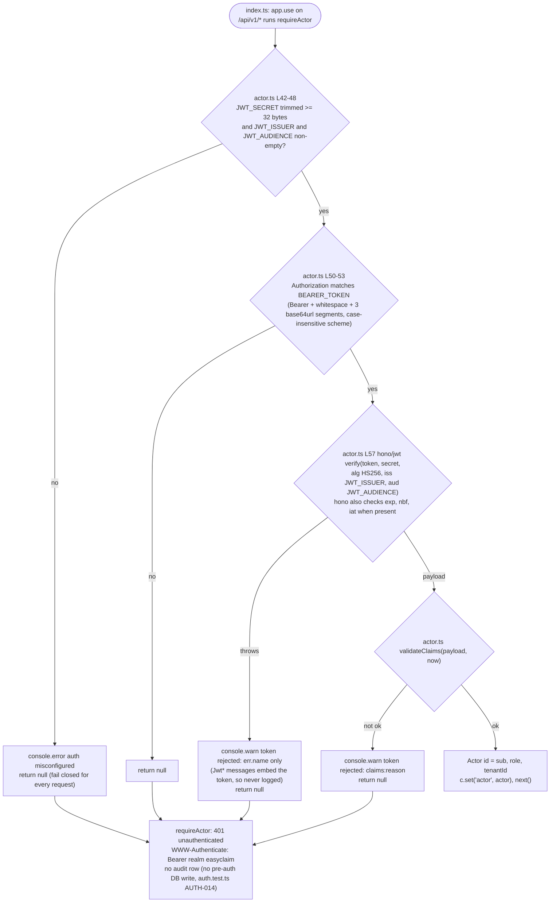
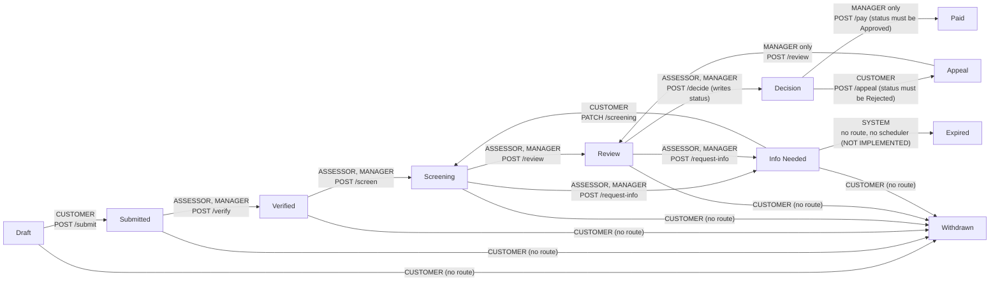
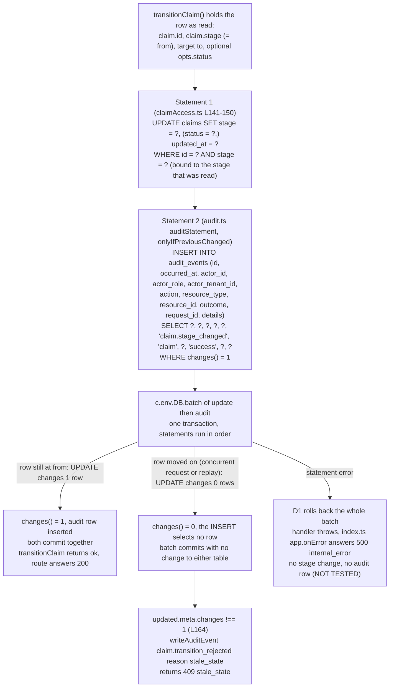
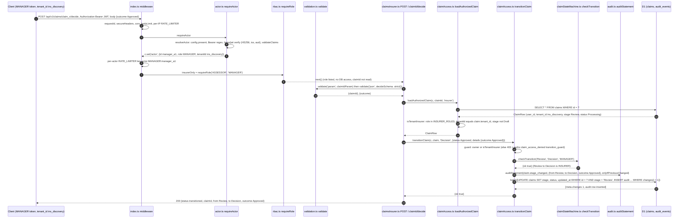

# Phase 1 Security Flow: what happens to a request, in the order the code does it

Date: 2026-09-26
Branch: `cyber` (Phase 1 work is UNCOMMITTED in the working tree; this report describes the working tree, not git HEAD)
Backend: Cloudflare Worker, Hono 4.13.9, TypeScript, D1, Queue (`backend/`)
Verified while writing: `npx vitest run` = 12 files, 175 passed, 1 todo; `npx tsc --noEmit` = exit 0.

Every file, function, route, error code and audit action named below exists in the working tree at the path given.
Where the code disagrees with an older document or a source comment, the code wins and the disagreement is listed in section 11.

## 1. Stage-by-stage status

The brief's canonical order is Request → Authentication → Validation → Tenant check → Ownership check → RBAC → State machine → Database change → Audit. The code implements every stage, but not in that order; section 2 shows the real order. This table gives the status per stage.

| Stage | Status | Where | Tested by |
|---|---|---|---|
| Request hardening (server-generated request id, `secureHeaders()`, CORS allowlist, 64 KiB body limit) | IMPLEMENTED | `backend/src/index.ts` L21-41 | `test/hardening.test.ts` |
| Per-IP rate limit (before auth) and per-actor rate limit (after auth) | IMPLEMENTED (approximate by design) | `backend/src/index.ts` L46-53, L60-67; `wrangler.toml` `[[ratelimits]]` 100 / 60 s | `test/hardening.test.ts` "rate limits per IP before auth and per actor after auth" |
| Authentication (Bearer JWT, HS256 pinned, iss/aud, required exp/iat/sub, role-based TTL cap, tenant rule per role) | IMPLEMENTED (shared secret); external IdP via `hono/jwt` `verifyWithJwks` PLANNED, documented only; revocation NOT IMPLEMENTED | `backend/src/security/actor.ts` `resolveActor()`, `validateClaims()`, `requireActor` | `test/auth.test.ts`, `test/actor.test.ts` |
| Validation (zod `.strict()` on every data-bearing route; bounded list `limit`) | IMPLEMENTED for claims/covers routes; PARTIAL overall (stubs `PATCH /profile`, `GET /profile/mandates/:tenantId/check` have no schema) | `backend/src/security/validation.ts` `validate()` | `test/massAssignment.test.ts`, `test/tenant.test.ts` "decide rejects invalid or extra fields" |
| Coarse RBAC (route-level, resource-independent) | IMPLEMENTED | `backend/src/security/rbac.ts` `requireRole()`; inline role branch in `GET /claims` (`claims.ts` L37-60) | `test/rbac.test.ts`, `tenant.test.ts` RBAC-001/002 |
| Tenant check (insurer staff only see/act on claims of their own tenant, never Drafts, never claims with NULL tenant) | IMPLEMENTED for claims; evidence BLOCKED (no evidence endpoint); ADMIN tenant semantics DECISION REQUIRED | `backend/src/security/claimAccess.ts` `isTenantInsurer()`, `loadAuthorizedClaim()`; `claims.ts` `GET /` and `POST /initiate` | `test/tenant.test.ts` TENANT-001..007, `test/migration.test.ts` |
| Ownership check (customers only see/act on `claims.user_id = actor.id`; policies by `policies.user_id`) | IMPLEMENTED | `claimAccess.ts` `loadAuthorizedClaim()` (`isOwner`); `claims.ts` `findOwnedPolicy()`; `models/policyModel.ts` `PolicyModel.getMyCovers()` | `test/bola.test.ts` |
| Per-transition RBAC + state machine | IMPLEMENTED (18 legal edges; 11 exposed over HTTP; `Withdrawn` has no route; `Info Needed → Expired` has no scheduler) | `backend/src/security/claimStateMachine.ts` `TRANSITIONS`, `checkTransition()`; `claimAccess.ts` `transitionClaim()` | `test/stateMachine.test.ts`, `tenant.test.ts` STATE-001..006, `test/claimLifecycle.test.ts` |
| Database change (conditional `UPDATE ... WHERE id = ? AND stage = ?` inside one D1 batch) | IMPLEMENTED | `claimAccess.ts` `transitionClaim()` L140-163 | `test/audit.test.ts` "same transaction", `claimLifecycle.test.ts` "double submit is rejected (replay)" |
| Audit (append-only table with UPDATE/DELETE triggers; success row gated on `changes() = 1`; a row per denial) | IMPLEMENTED; triggers droppable by anyone with D1 admin access = open risk | `backend/src/security/audit.ts` `auditStatement()`, `writeAuditEvent()`; `migrations/0002_security.sql`, `0003_tenants.sql` | `test/audit.test.ts`, `tenant.test.ts` AUDIT-001 |

## 2. The real per-request order (flowchart)

This is the order the middleware and handlers actually run in, from `backend/src/index.ts` through a claim route. Exit codes and the audit event written at each denial are on the diagram; section 7 lists them in a table.

Points where the code differs from the canonical list:

- The coarse role gate (`requireRole`) runs before validation and before the claim is loaded. Section 3 explains why that does not leak cross-tenant or cross-customer information.
- Tenant and ownership checks are not two sequential stages. They are two branches of one decision inside `loadAuthorizedClaim()`: a `CUSTOMER` is judged by ownership only (customers have no tenant), insurer staff (`ASSESSOR`, `MANAGER`) are judged by tenant only. Within the insurer branch the order is tenant unset → cross tenant → draft → mode.
- The per-transition role is checked a second time inside the state machine (`checkTransition(from, to, actor.role)`), because the coarse gate cannot know that, for example, `Appeal → Review` is `MANAGER`-only while `Screening → Review` is open to both insurer roles (both go through `POST /claims/:claimId/review`).
- Audit is not a final step. Each denial writes its own row at the point of denial, and the success row for a stage change is inserted in the same D1 batch as the `UPDATE` (section 6).

Route middleware chains as registered (the diagram's ROLE → VAL → LOAD sequence is literally the argument order of each `router.post(...)`):

| Route | Middleware chain, in order | Access mode | Transition |
|---|---|---|---|
| `GET /claims` (`claims.ts` L33) | `validate('query', listQuerySchema)` → inline role branch (CUSTOMER: own rows; insurer: tenant rows excluding Draft, no `user_id`; otherwise 403 + `authz.role_denied`) | list scoping, no claim load | none |
| `POST /claims/verify-eligibility` (`claims.ts` L67) | `requireRole('CUSTOMER')` → `validate('json', verifyEligibilitySchema)` → `findOwnedPolicy()` | policy ownership | none |
| `POST /claims/initiate` (`claims.ts` L78) | `requireRole('CUSTOMER')` → `validate('json', initiateClaimSchema)` → `findOwnedPolicy()` → INSERT with `tenant_id` copied from the policy | policy ownership | creates Draft |
| `PATCH /claims/:claimId/screening` (`claims.ts` L123) | `requireRole('CUSTOMER')` → `validate('param')` → `validate('json', screeningSchema)` → `loadAuthorizedClaim(.., 'owner-write')` → conditional UPDATE (`stage IN ('Draft','Info Needed')`) → `transitionClaim(.., 'Screening')` only when the stage was `Info Needed` | owner-write | Info Needed → Screening |
| `POST /claims/:claimId/evidence-ocr` (`claims.ts` L165) | `requireRole('CUSTOMER')` → `validate('param')` → `loadAuthorizedClaim(.., 'owner-write')` → queue send | owner-write | none (queues an event only; no file is stored) |
| `POST /claims/:claimId/submit` (`claims.ts` L187) | `requireRole('CUSTOMER')` → `validate('param')` → `loadAuthorizedClaim(.., 'owner-write')` → `transitionClaim(.., 'Submitted')` | owner-write | Draft → Submitted |
| `GET /claims/:claimId/timeline` (`claims.ts` L206) | `validate('param')` → `loadAuthorizedClaim(.., 'read')` (no `requireRole`; ADMIN is denied inside the load with reason `role`) | read | none |
| `GET /claims/:claimId/decision` (`claims.ts` L238) | `validate('param')` → `loadAuthorizedClaim(.., 'read')` | read | none |
| `POST /claims/:claimId/appeal` (`claims.ts` L246) | `requireRole('CUSTOMER')` → `validate('param')` → `validate('json', appealSchema)` → `loadAuthorizedClaim(.., 'owner-write')` → precondition stage `Decision` and status `Rejected` → `transitionClaim(.., 'Appeal')` | owner-write | Decision → Appeal |
| `POST /claims/:claimId/verify` `/screen` `/review` `/request-info` (`claimsInsurer.ts` L34-66) | `insurerOnly` = `requireRole('ASSESSOR','MANAGER')` → `validate('param', claimIdParam)` → `loadAuthorizedClaim(.., 'insurer')` → `transitionClaim(.., target)` | insurer | Submitted → Verified; Verified → Screening; Screening/Appeal → Review; Screening/Review → Info Needed |
| `POST /claims/:claimId/decide` (`claimsInsurer.ts` L69) | `insurerOnly` → `validate('param')` → `validate('json', decideSchema)` → `loadAuthorizedClaim(.., 'insurer')` → `transitionClaim(.., 'Decision', { status: outcome, details: { outcome } })` | insurer | Review → Decision (writes `claims.status`) |
| `POST /claims/:claimId/pay` (`claimsInsurer.ts` L80) | `insurerOnly` → `validate('param')` → `loadAuthorizedClaim(.., 'insurer')` → `checkTransition()` pre-check, then `status = 'Approved'` precondition (409 `not_approved`, audited) → `transitionClaim(.., 'Paid')` | insurer | Decision → Paid (MANAGER by state machine; state transition only, no payment) |

Routes outside the claim flow that still pass through `requireActor`: `covers/*` (`policy.ts`; `my-covers` and `join-request` are `requireRole('CUSTOMER')`), `ocr/process` (`ocr.ts`, `requireRole('ASSESSOR','MANAGER')`, stub), `profile/*` (`identity.ts`, stubs; `mandates/cancel` is `requireRole('CUSTOMER')` and audited), `client/*` (`gateway.ts`, static data) and `activities/*` (`endpoints/audit.ts`, returns empty arrays).

## 3. Why the coarse role gate runs first, and why that is not an information leak

`requireRole()` in `backend/src/security/rbac.ts` is nine lines. It reads two things: `c.get('actor').role`, which came from the verified token, and `c.req.routePath`, which is the matched route pattern (for example `/api/v1/claims/:claimId/verify`, not the concrete id). It does not touch D1, does not read the `:claimId` parameter, and does not read the body.

Consequences:

1. Its answer is a pure function of (role, route). A `CUSTOMER` calling `POST /claims/<anything>/verify` gets `403 forbidden` for an existing claim, a missing claim, another customer's claim and another insurer's claim alike (`tenant.test.ts` RBAC-001). The 403 tells the caller only what their own token already says: this role may not use this route.
2. Because it runs before `validate('param')`, a malformed claim id also gets 403 from a wrong-role caller instead of 400. That removes one distinguishing signal rather than adding one.
3. The audit row it writes (`authz.role_denied`, `resource_type = 'route'`, `resource_id = "POST /api/v1/claims/:claimId/verify"`) records the route pattern, so a denied caller's guessed ids are not persisted either.
4. Insurer staff of the wrong tenant pass the coarse gate (their role is allowed on the route) and are then refused by `loadAuthorizedClaim()` with `404 not_found`, the same status and body a non-existent claim returns (`tenant.test.ts` TENANT-003b, `bola.test.ts` "denied and non-existent claims look identical"). The tenant/ownership decision is the only place where the claim row is consulted, and it never distinguishes "exists but not yours" from "does not exist" in the response.

So the response surface is: 401 (no valid token) → 403 (your role cannot use this route, regardless of resource) → 400 (your input shape is wrong) → 404 (either the claim does not exist or you may not know that it does). Cross-tenant and cross-customer existence is not observable at any step.

A related design choice in `loadAuthorizedClaim()`: the audit `details` name the actor's own context (`mode`, `exists`, `reason`) and the row carries the actor's `actor_tenant_id`; the target claim's tenant or owner is never written into the denial row (`tenant.test.ts` TENANT-001 asserts the row contains neither `ins_discovery` nor `user123`).

## 4. Authentication: `resolveActor()` in detail

`validateClaims()` (`actor.ts` L87-106) is pure and unit-tested through `actorFromClaims()` (`actor.test.ts`). Its fixed reason tokens, in evaluation order: `not_object`, `missing_exp`, `missing_iat`, `bad_sub`, `unknown_role`, `expired` (`exp <= now`), `ttl_exceeded` (`exp - now > MAX_TOKEN_TTL_SECONDS[role]`: CUSTOMER 24 h, ASSESSOR/MANAGER/ADMIN 8 h), `bad_tenant` (not matching `ID_PATTERN` from `types.ts`), `customer_with_tenant`, `staff_without_tenant`. `sub` and `tenant_id` must match `ID_PATTERN = /^[A-Za-z0-9_-]{1,64}$/`; `role` must be in `ROLES` from `types.ts`.

Tenant rule per role (`types.ts` `Actor`): `CUSTOMER` tenantId is always `null` (platform-level; the seed shows `user123` holding Discovery, Sanlam and Old Mutual policies); `ASSESSOR`/`MANAGER` tenantId is required; `ADMIN` may carry or omit it, and no code path uses an ADMIN tenant today (DECISION REQUIRED: platform admin vs tenant admin; `tenant.test.ts` TENANT-001b shows an ADMIN token with a tenant still gets no claim or list access).

Configuration: `JWT_SECRET` is a secret binding only (`backend/.dev.vars` locally, created by `npm run setup:local` = `scripts/setup-dev-vars.mjs`; `wrangler secret put JWT_SECRET` when deployed). `JWT_ISSUER` and `JWT_AUDIENCE` are `[vars]` in `wrangler.toml` (`easyclaim-dev` / `easyclaim-api`). Local tokens: `npm run token` = `scripts/mint-token.mjs`, which mirrors the server's claim rules and refuses to mint a token the server would reject. The Phase 0 `X-Dev-Actor-*` header stub has no code path left; `auth.test.ts` AUTH-011 and `actor.test.ts` assert the headers are ignored even with the old flag set. What is NOT IMPLEMENTED: token revocation (bounded lifetime and secret rotation are the compensating controls) and asymmetric keys / JWKS (documented as the future IdP path via `hono/jwt` `verifyWithJwks`).

## 5. Object-level authorization: `loadAuthorizedClaim()` decision

`backend/src/security/claimAccess.ts` L50-82. One `SELECT * FROM claims WHERE id = ?`, then:

| Input | Computed as |
|---|---|
| `isOwner` | `claim !== null && actor.role === 'CUSTOMER' && claim.user_id === actor.id` |
| `tenantInsurer` | `claim !== null && isTenantInsurer(actor, claim)` = role in `INSURER_ROLES` and `actor.tenantId !== null` and `claim.tenant_id !== null` and equal and `claim.stage !== 'Draft'` |
| `allowed` for mode `owner-write` | `isOwner` |
| `allowed` for mode `insurer` | `tenantInsurer` |
| `allowed` for mode `read` | `isOwner || tenantInsurer` |

If not allowed, the denial reason is the first match in this chain, then one `authz.claim_access_denied` row is written and the caller answers `404 {"error":"not_found"}`:

| Order | Condition | `reason` | Test |
|---|---|---|---|
| 1 | no row | `missing` | `bola.test.ts`, TENANT-003b |
| 2 | role `CUSTOMER` and not owner | `not_owner` | `bola.test.ts` |
| 2' | role `CUSTOMER`, owner, but mode `insurer` | `mode` | NOT TESTED directly (no customer route uses mode `insurer`) |
| 3 | role not in `INSURER_ROLES` (ADMIN) | `role` | `rbac.test.ts` "admin has no claim-reading powers", TENANT-001b |
| 4 | `claim.tenant_id IS NULL` | `tenant_unset` | TENANT-005 |
| 5 | `claim.tenant_id !== actor.tenantId` | `cross_tenant` | TENANT-001, TENANT-002 |
| 6 | `claim.stage === 'Draft'` | `draft` | TENANT-001c |
| 7 | insurer in tenant, but mode `owner-write` | `mode` | `bola.test.ts` "insurer staff can read, but not act as the customer" reaches 403 at the coarse gate first, so this branch is NOT TESTED over HTTP |

Fail-closed cases worth stating: a claim whose `tenant_id` is NULL is visible to no insurer (only its owner); a policy whose `tenant_id` is NULL cannot start a claim (`POST /initiate` → 422 `policy_not_eligible`, reason `policy_missing_tenant`, TENANT-007). `migrations/0003_tenants.sql` backfills only the five known seed policies by id, so any other legacy row keeps NULL and stays invisible to insurers (`migration.test.ts`).

## 6. State machine and the D1 batch

### 6.1 Legal edges (`claimStateMachine.ts` `TRANSITIONS`) and which route exposes each

18 edges in the table, 11 reachable over HTTP. `ADMIN` appears in no edge (`stateMachine.test.ts` "ADMIN appears in no transition"). `Paid`, `Withdrawn`, `Expired` are terminal. `checkTransition()` returns `unknown_stage`, `illegal_transition` or `role_not_permitted`; `transitionClaim()` maps the last to 403 and the other two to 409 `illegal_transition`.

### 6.2 The one write path: `transitionClaim()` and the batch

`transitionClaim()` (`claimAccess.ts` L103-176) is the only code that changes `claims.stage`. After the guard and `checkTransition()`, it builds two prepared statements and runs them in one `c.env.DB.batch([...])`, which D1 executes as a single transaction in order. The second statement is built by `auditStatement()` in `audit.ts` with `onlyIfPreviousChanged: true`, which turns the `INSERT ... VALUES` into `INSERT ... SELECT ... WHERE changes() = 1`. SQLite's `changes()` is the row count of the immediately preceding statement on the same connection, so the audit row can only exist if the conditional `UPDATE` changed exactly one row.

Properties this gives, and where they are tested:

- A stage change and its audit row always exist together, or neither does (`audit.test.ts` "a stage-change audit row is written only when the stage change applied (same transaction)" replays the exact batch with a stale and then a fresh precondition).
- Two concurrent or replayed requests cannot both apply: the second sees `changes = 0` and gets 409 `stale_state` (over HTTP the observable case is `claimLifecycle.test.ts` "double submit is rejected (replay)", where the second request is refused by the state machine as `illegal_transition` because the first already committed; a true same-instant race producing `stale_state` is NOT TESTED).
- `PATCH /screening` uses the same pattern for its data write (`WHERE id = ? AND stage IN ('Draft','Info Needed')`, `claims.ts` L139-144) but audits with a separate `writeAuditEvent` call afterwards, so that path is sequential, not batched (PARTIAL relative to the transition path).
- The audit `details` for `claim.stage_changed` are `{ from, to, ...opts.details }`; `GET /claims/:claimId/timeline` reads these rows back (`claims.ts` L210-222) and exposes only `to` and `occurred_at`, so the audit table is also the customer-visible timeline source. `opts.details` is typed as identifiers and state names only (`TransitionOptions` in `claimAccess.ts`), and `audit.test.ts` asserts no `causeOfLoss` text, header or token ever lands in a row.

### 6.3 Worked sequence: `POST /claims/:claimId/decide` by a MANAGER of the claim's tenant

Denied variants of the same call, for contrast: an `ASSESSOR` of the same tenant passes steps 7-18 and is accepted (Review → Decision is open to both insurer roles); a `MANAGER` of `ins_sanlam` fails at step 14 (`cross_tenant`, 404); a `CUSTOMER` fails at step 7 (403, `authz.role_denied`); an `ADMIN` fails at step 7 as well; a `MANAGER` of the right tenant on a claim still in `Submitted` fails at step 19 (`illegal_transition`, 409); `{outcome: 'Paid'}` or an extra `amount` field fails at step 9 (400).

## 7. Exit codes, where they come from, and what is audited

| Code | Body | Emitted by | Audit row | Tested by |
|---|---|---|---|---|
| 400 | `validation_failed`, `issues[{path,code,message}]` | `validation.ts` `validate()` | none | `massAssignment.test.ts`; `tenant.test.ts` "decide rejects invalid or extra fields", TENANT-006 (`limit=500`) |
| 400 | `Malformed JSON in request body` (hono validator `HTTPException` via `index.ts` `app.onError`) | hono `validator` + `index.ts` L80-83 | none | `hardening.test.ts` "malformed JSON returns 400" |
| 401 | `unauthenticated` + `WWW-Authenticate: Bearer realm="easyclaim"` | `actor.ts` `requireActor` | none (AUTH-014) | `auth.test.ts` AUTH-001..013, `actor.test.ts` |
| 403 | `forbidden` | `rbac.ts` `requireRole()` | `authz.role_denied` (route pattern) | `rbac.test.ts`; `tenant.test.ts` RBAC-001/002, AUDIT-001 |
| 403 | `forbidden` | `claims.ts` `GET /` inline branch (ADMIN, or insurer without tenant which the token rules already exclude) | `authz.role_denied` (`GET /claims`) | TENANT-001b, TENANT-006 |
| 403 | `forbidden` | `claimAccess.ts` `transitionClaim()` guard | `authz.claim_access_denied` (`mode: 'transition'`, `reason: 'transition_guard'`) | NOT TESTED over HTTP: every route loads the claim through `loadAuthorizedClaim()` first, so this is defence in depth against a future caller that does not |
| 403 | `forbidden` | `transitionClaim()` after `checkTransition()` = `role_not_permitted` | `claim.transition_rejected` (`from`, `to`, `reason`) | STATE-003 (assessor cannot pay), STATE-005 (assessor cannot re-review an appeal) |
| 404 | `not_found` | `claimAccess.ts` `loadAuthorizedClaim()` returned null | `authz.claim_access_denied` (`mode`, `exists`, `reason`) | `bola.test.ts`; TENANT-001..005; `rbac.test.ts` admin |
| 404 | `not_found` | `index.ts` `app.notFound` | none | `hardening.test.ts` "unknown routes return JSON 404" |
| 409 | `claim_not_editable` (+ `stage`) | `claims.ts` screening / evidence-ocr precondition on the loaded row | none | `claimLifecycle.test.ts` "a claim already in Review cannot be re-submitted or edited by the customer" |
| 409 | `claim_not_editable` | `claims.ts` L144, conditional UPDATE changed 0 rows | none | NOT TESTED (race window only) |
| 409 | `not_appealable` | `claims.ts` `POST /appeal` precondition | none | `claimLifecycle.test.ts` "an approved decision cannot be appealed", "a rejected decision can be appealed exactly once" |
| 409 | `not_approved` | `claimsInsurer.ts` `POST /pay` precondition | `claim.transition_rejected` (`reason: 'not_approved'`) | STATE-005 |
| 409 | `illegal_transition` | `transitionClaim()` after `checkTransition()` = `illegal_transition` or `unknown_stage` | `claim.transition_rejected` | STATE-004; `claimLifecycle.test.ts` "double submit is rejected (replay)" |
| 409 | `stale_state` | `transitionClaim()` batch `meta.changes !== 1` | `claim.transition_rejected` (`reason: 'stale_state'`) | mechanism in `audit.test.ts`; HTTP race NOT TESTED |
| 413 | `payload_too_large` | `index.ts` `bodyLimit` (runs before auth) | none | `hardening.test.ts` |
| 422 | `policy_not_eligible` | `claims.ts` `POST /initiate` | `claim.initiate_rejected` (`reason`: `policy_not_owned` / `policy_not_active` / `policy_missing_tenant`) | `bola.test.ts`, `claimLifecycle.test.ts`, TENANT-007 |
| 422 | `screening_incomplete` | `claims.ts` `POST /submit` | none | `claimLifecycle.test.ts` "cannot submit before screening is complete" |
| 422 | `unknown_plan` | `policy.ts` `POST /join-request` | none | NOT TESTED |
| 429 | `rate_limited` | `index.ts` per-IP (`/api/*`, before auth) and per-actor (`/api/v1/*`, after auth) | none | `hardening.test.ts` |
| 500 | `internal_error` + `requestId` | `index.ts` `app.onError` (stack traces never returned) | none | `hardening.test.ts` "internal errors return a generic 500 without stack traces" |

Which denials are deliberately not audited: 401 (no pre-auth DB write, so an unauthenticated flood cannot fill the audit table), 429, 400, 413, route-level 404 and 500. Every authorization denial (role, ownership, tenant, per-transition role, illegal or stale transition, unapproved payout) writes a row.

## 8. Every audit action emitted today

Grep basis: `action: '` across `backend/src` (the `action` keys in `gateway.ts` are static response fields, not audit events). Ten distinct actions. No code path emits outcome `failure` yet, although the CHECK constraint allows it.

| Action | Outcome | resource_type | Source (file → function or route) | `details` keys |
|---|---|---|---|---|
| `authz.role_denied` | denied | `route` | `src/security/rbac.ts` → `requireRole()`; `src/endpoints/claims.ts` → `GET /` inline branch | none |
| `authz.claim_access_denied` | denied | `claim` | `src/security/claimAccess.ts` → `loadAuthorizedClaim()`; `src/security/claimAccess.ts` → `transitionClaim()` guard | `mode`, `exists`, `reason` |
| `claim.transition_rejected` | denied | `claim` | `src/security/claimAccess.ts` → `transitionClaim()` (state machine reject and `stale_state`); `src/endpoints/claimsInsurer.ts` → `POST /:claimId/pay` (`not_approved`) | `from`, `to`, `reason`, plus `opts.details` (`outcome` on decide) |
| `claim.stage_changed` | success | `claim` | `src/security/claimAccess.ts` → `transitionClaim()` via `src/security/audit.ts` → `auditStatement(.., { onlyIfPreviousChanged: true })` inside `DB.batch` | `from`, `to`, plus `opts.details` |
| `claim.initiate_rejected` | denied | `policy` | `src/endpoints/claims.ts` → `POST /initiate` | `reason` |
| `claim.created` | success | `claim` | `src/endpoints/claims.ts` → `POST /initiate` | `policyId`, `tenantId` |
| `claim.screening_updated` | success | `claim` | `src/endpoints/claims.ts` → `PATCH /:claimId/screening` | none |
| `claim.evidence_queued` | success | `claim` | `src/endpoints/claims.ts` → `POST /:claimId/evidence-ocr` | none |
| `cover.join_requested` | success | `catalog_plan` | `src/endpoints/policy.ts` → `POST /join-request` | none |
| `mandate.cancel_requested` | success | `mandate` | `src/endpoints/identity.ts` → `POST /mandates/cancel` (stub route) | none |

Row shape (`audit.ts` `COLUMNS`, `migrations/0002_security.sql` + `0003_tenants.sql`): `id` (UUID), `occurred_at`, `actor_id`, `actor_role`, `actor_tenant_id` (NULL for customers), `action`, `resource_type`, `resource_id`, `outcome` (CHECK in `success | denied | failure`), `request_id` (the server-generated `X-Request-Id`), `details` (JSON of identifiers and state names only). Triggers `audit_events_no_update` / `audit_events_no_delete` abort UPDATE and DELETE (`audit.test.ts`). The Phase 1 additions to this table are the `actor_tenant_id` column and the `changes() = 1` gating; everything else predates Phase 1.

## 9. Rate limiting placement

Two `RATE_LIMITER.limit()` calls share one binding (`wrangler.toml`: 100 requests per 60 s, approximate and per-location by Cloudflare's design):

1. `index.ts` L46-53, path `/api/*`, key `cf-connecting-ip` (falls back to the literal `unknown`), before `requireActor`. Throttles unauthenticated floods without touching the token.
2. `index.ts` L60-67, path `/api/v1/*`, key `actor:${role}:${id}`, after `requireActor`. One credential cannot spread its budget across addresses. `hardening.test.ts` asserts the key order `['unknown', 'actor:CUSTOMER:user123']` and that an unauthenticated request never reaches the actor limiter.

When the binding is absent (for example a local config without `[[ratelimits]]`) both middlewares pass through silently; `hardening.test.ts` "rate limit binding is configured" guards the test config. No route-specific stricter limits exist (BACKEND-SEC-012 remains PARTIAL).

## 10. What this flow does not cover (open after Phase 1)

| Item | Status | Note |
|---|---|---|
| Evidence upload, storage, per-tenant evidence isolation | NOT IMPLEMENTED / BLOCKED | `POST /evidence-ocr` only queues an event; `evidence` table exists unused; `tenant.test.ts` TENANT-004 is `it.todo` |
| Decision record (amount, reason, evidence hashes) | NOT IMPLEMENTED | `POST /decide` writes only `claims.status`; `GET /decision` reads it |
| Payout execution, idempotency key, destination verification, second approver | NOT IMPLEMENTED | `POST /pay` is a state transition; state machine already restricts it to MANAGER and the route to status `Approved` |
| Withdraw route, expiry scheduler | NOT IMPLEMENTED | 7 of 18 legal edges have no HTTP or scheduled path |
| Audit triggers droppable by a D1 admin (`wrangler d1 execute`) | open, accepted risk | `docs/security/AUDIT_SECURITY.md` L57 |
| Queue consumer not firing under `wrangler dev` | open, pre-existing | logic covered by `test/queue.test.ts` only |
| Rate limiting approximate; no per-route limits | PARTIAL | section 9 |
| Token revocation, external IdP / JWKS | NOT IMPLEMENTED / PLANNED | section 4 |
| ADMIN tenant semantics | DECISION REQUIRED | `types.ts` L17, `actor.test.ts` "admin may omit tenant" |
| Per-tenant claimant reference (insurer list hides platform `user_id`, so tenant staff have no claimant identifier at all) | DECISION REQUIRED | `claims.ts` L48-49 |
| Stub routes without schemas or real data (`PATCH /profile`, `GET /profile/mandates/:tenantId/check`, `client/*`, `activities/*`) | PARTIAL (behind `requireActor` only) | BACKEND-SEC-010 |
| CI running `npm test` / `typecheck` / `audit` | NOT IMPLEMENTED | BACKEND-SEC-014 |

## 11. Discrepancies found while writing this report (documentation only; no code was changed)

1. `backend/src/endpoints/claimsInsurer.ts` L14-20 (header comment) lists "2. validate params/body" before "3. coarse role gate", but every route in that file is registered as `insurerOnly, validate('param', ...)`, so the role gate runs first. The diagram in section 2 follows the registered order. The comment should be reordered in the Phase 1 doc pass.
2. `README.md` L12, L114-118 and L176-185, `docs/security/README.md` L3-4, L10, L13 and L22, and `docs/security/BACKEND_SECURITY_HANDOFF.md` statuses for BACKEND-SEC-001, -002, -003, -012 and -013 still describe the Phase 0 state (dev header stub, no tenant scoping, no insurer routes, sequential audit writes). Each of those is now IMPLEMENTED (or PARTIAL for -012) as shown above.
3. `docs/security/API_SECURITY_MATRIX.md`, `RBAC_MATRIX.md`, `SECURITY_TEST_PLAN.md`, `ATTACK_SCENARIOS.md` and `docs/architecture/BACKEND_ARCHITECTURE.md` were flagged in `PHASE_01_PRECHECK.md` section 5 as mentioning the dev stub; they were not re-audited here.

## 12. Files and functions referenced

Source
- `backend/src/index.ts`: request-id middleware, `secureHeaders()`, `cors()`, `bodyLimit()`, per-IP and per-actor `RATE_LIMITER` middlewares, `app.use('/api/v1/*', requireActor)`, `app.route(...)` mounts, `app.notFound`, `app.onError`, `queue` export
- `backend/src/types.ts`: `ROLES`, `Role`, `INSURER_ROLES`, `ID_PATTERN`, `Actor`, `Bindings`, `AppEnv`
- `backend/src/security/actor.ts`: `JWT_ALG`, `MIN_SECRET_BYTES`, `MAX_TOKEN_TTL_SECONDS`, `BEARER_TOKEN`, `resolveActor()`, `ClaimRejectReason`, `validateClaims()`, `actorFromClaims()`, `requireActor`
- `backend/src/security/rbac.ts`: `requireRole()`
- `backend/src/security/validation.ts`: `claimIdParam`, `initiateClaimSchema`, `verifyEligibilitySchema`, `screeningSchema`, `appealSchema`, `joinRequestSchema`, `decideSchema`, `listQuerySchema`, `validate()`
- `backend/src/security/claimAccess.ts`: `ClaimRow`, `ClaimAccessMode`, `isTenantInsurer()`, `loadAuthorizedClaim()`, `TransitionOutcome`, `TransitionOptions`, `transitionClaim()`
- `backend/src/security/claimStateMachine.ts`: `CLAIM_STAGES`, `ClaimStage`, `MAIN_PATH`, `TransitionActor`, `TRANSITIONS`, `isClaimStage()`, `checkTransition()`
- `backend/src/security/audit.ts`: `AuditEvent`, `COLUMNS`, `auditStatement()`, `writeAuditEvent()`
- `backend/src/endpoints/claims.ts`: `findOwnedPolicy()`, `GET /status`, `GET /`, `POST /verify-eligibility`, `POST /initiate`, `PATCH /:claimId/screening`, `POST /:claimId/evidence-ocr`, `POST /:claimId/submit`, `GET /:claimId/timeline`, `GET /:claimId/decision`, `POST /:claimId/appeal`
- `backend/src/endpoints/claimsInsurer.ts`: `insurerOnly`, `respond()`, `POST /:claimId/verify`, `/screen`, `/review`, `/request-info`, `/decide`, `/pay`
- `backend/src/endpoints/policy.ts`: `GET /my-covers`, `GET /market-catalog`, `POST /join-request`
- `backend/src/endpoints/identity.ts`: `POST /mandates/cancel` and stubs
- `backend/src/endpoints/ocr.ts`: `POST /process`, `processQueueBatch()`
- `backend/src/endpoints/gateway.ts`, `backend/src/endpoints/audit.ts`: static stubs
- `backend/src/models/policyModel.ts`: `PolicyModel.getMyCovers()`

Configuration, migrations, scripts
- `backend/wrangler.toml` (`[[ratelimits]]`, `[vars]` `JWT_ISSUER` / `JWT_AUDIENCE`), `backend/.dev.vars.example`, `backend/package.json` scripts `token`, `setup:local`, `secret`
- `backend/migrations/0001_init.sql`, `0002_security.sql`, `0003_tenants.sql`; `backend/seed_sa_data.sql`
- `backend/scripts/mint-token.mjs`, `backend/scripts/setup-dev-vars.mjs`

Tests
- `backend/test/helpers.ts` (`mintToken()`, `call()`, `auditRows()`, `claimStage()`, `createReadyDraft()`, `createSubmittedClaim()`), `setup.ts`, `env.d.ts`, `vitest.config.mts`
- `backend/test/actor.test.ts`, `auth.test.ts`, `tenant.test.ts`, `migration.test.ts`, `bola.test.ts`, `rbac.test.ts`, `massAssignment.test.ts`, `claimLifecycle.test.ts`, `hardening.test.ts`, `audit.test.ts`, `queue.test.ts`, `stateMachine.test.ts`

Documents consulted
- `docs/phase-reports/PHASE_01_PRECHECK.md`, `docs/security/BACKEND_SECURITY_HANDOFF.md`, `docs/security/README.md`, `docs/security/AUDIT_SECURITY.md`, `README.md`
- `backend/node_modules/hono/dist/request.js` (`routePath` getter), `dist/validator/validator.js` (malformed JSON → `HTTPException(400)`), `dist/middleware/body-limit/index.js` (Content-Length check before streaming)
