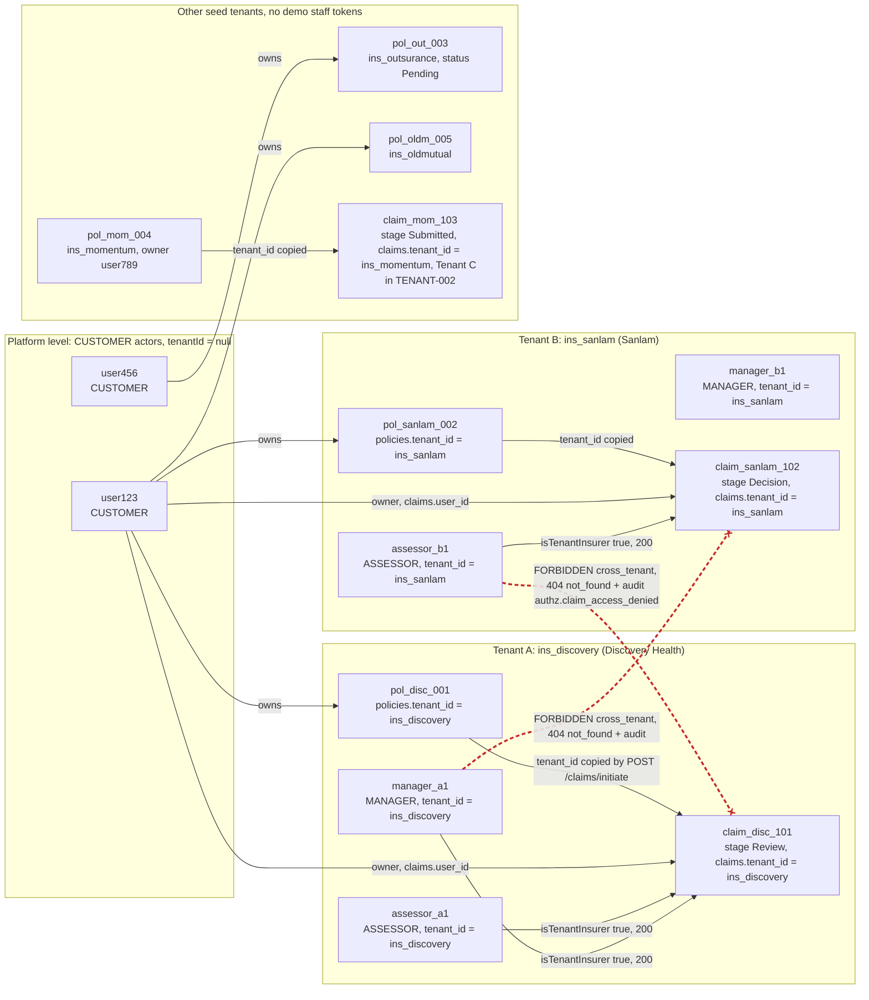
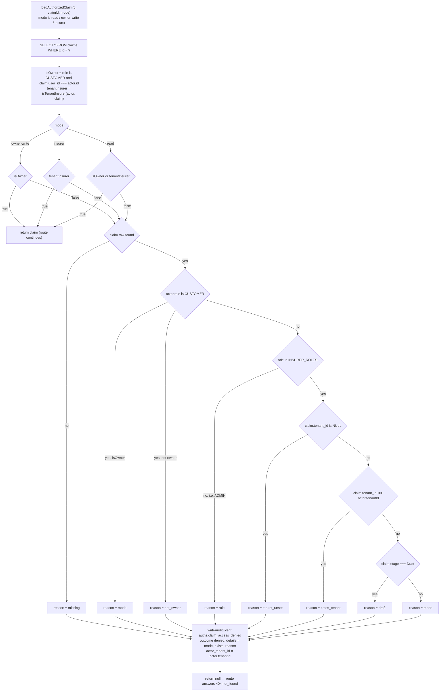
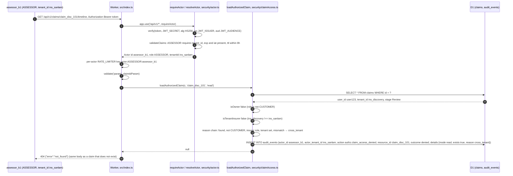
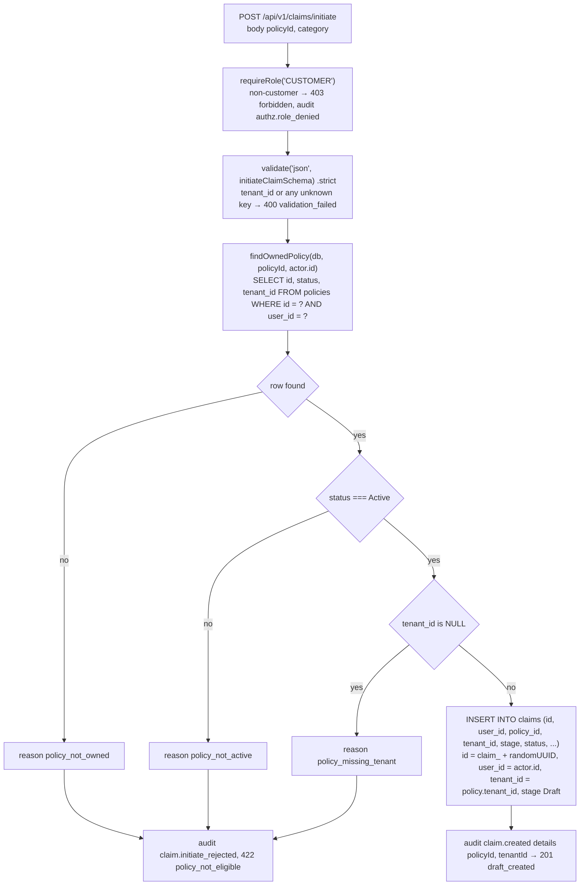
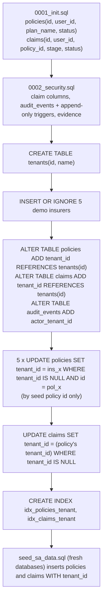

# Phase 1 Report: Tenant Model

> Layout note: this report was recorded at commit `cb2588a`, when the Worker lived under `backend/`. The backend team later moved it to the repository root on `main`; on 2026-09-26 every path in this document was rewritten to that root layout (`backend/src/...` is now `src/...`).

Date: 2026-09-26
Branch: `cyber` (Phase 1 work is uncommitted in the working tree; this report describes the working tree, not git HEAD)
Backend: Cloudflare Worker, Hono 4.13.9, TypeScript, D1, Queue
Verification for this report: `npm test` at the repository root on 2026-09-26 01:48 → Test Files 12 passed (12), Tests 183 passed | 1 todo (184), 17.69 s. (An earlier run at 01:35 reported 175 passed | 1 todo; `audit.test.ts`, `auth.test.ts`, `helpers.ts`, `massAssignment.test.ts` and `tenant.test.ts` were edited between the two runs.) Re-run by the report checker on 2026-09-26 04:24 against the same working tree → Test Files 12 passed (12), Tests 183 passed | 1 todo (184), 19.13 s. Every file, function, route, column and test id named below was read in the working tree.

Status vocabulary used here: IMPLEMENTED / PARTIAL / NOT IMPLEMENTED / PLANNED / BLOCKED / NOT TESTED / DECISION REQUIRED.

---

## 1. Summary

| Topic | Status | Where |
|---|---|---|
| `tenants` reference table, five demo insurers | IMPLEMENTED | `migrations/0003_tenants.sql` |
| `policies.tenant_id`, `claims.tenant_id` (`REFERENCES tenants(id)`), `audit_events.actor_tenant_id` | IMPLEMENTED | `0003_tenants.sql`; `claims.tenant_id` written by `claims.ts` `POST /initiate`, `actor_tenant_id` by `security/audit.ts` `auditStatement()` |
| `tenant_id` claim in the bearer token → `Actor.tenantId` | IMPLEMENTED | `src/security/actor.ts` `validateClaims()`; `src/types.ts` `Actor` |
| Role rule: CUSTOMER must not carry a tenant, ASSESSOR/MANAGER must, ADMIN optional | IMPLEMENTED (ADMIN: DECISION REQUIRED) | `validateClaims()` reasons `customer_with_tenant`, `staff_without_tenant` |
| Object-level tenant boundary on every `:claimId` route | IMPLEMENTED | `src/security/claimAccess.ts` `loadAuthorizedClaim()`, `isTenantInsurer()` |
| Tenant re-check inside every stage change | IMPLEMENTED | `claimAccess.ts` `transitionClaim()` (`transition_guard`) |
| List scoping (customer → own, insurer → own tenant minus Draft, ADMIN → 403) | IMPLEMENTED | `src/endpoints/claims.ts` `GET /` |
| Claim inherits tenant from the policy at creation; client cannot set it | IMPLEMENTED | `claims.ts` `POST /initiate`, `findOwnedPolicy()`; strict zod schemas in `security/validation.ts` |
| Fail closed on `tenant_id IS NULL` and on `stage = 'Draft'` | IMPLEMENTED | `isTenantInsurer()`; deny reasons `tenant_unset`, `draft` |
| Backfill of pre-existing local databases (by seed policy id only) | IMPLEMENTED | `0003_tenants.sql`; `test/migration.test.ts` |
| Token `tenant_id` checked against the `tenants` table at authentication | NOT IMPLEMENTED / NOT TESTED | `validateClaims()` only applies `ID_PATTERN` |
| Staff directory / tenant membership stored in the database | NOT IMPLEMENTED | membership is only a token claim (see §3) |
| Tenant administration routes (create tenant, assign staff) | NOT IMPLEMENTED / DECISION REQUIRED | none exist |
| Evidence isolation per tenant | BLOCKED | no evidence endpoint (`tenant.test.ts` TENANT-004 is `it.todo`) |
| Per-tenant claimant reference instead of platform `user_id` | DECISION REQUIRED | `claims.user_id`; `claims.ts` list comment |

---

## 2. What a tenant is

A tenant is an insurer organisation. It is a row in `tenants` (`migrations/0003_tenants.sql`):

```sql
CREATE TABLE IF NOT EXISTS tenants (
    id TEXT PRIMARY KEY,
    name TEXT NOT NULL
);
INSERT OR IGNORE INTO tenants (id, name) VALUES
('ins_discovery', 'Discovery Health'),
('ins_sanlam', 'Sanlam'),
('ins_outsurance', 'OUTsurance'),
('ins_momentum', 'Momentum'),
('ins_oldmutual', 'Old Mutual');
```

Three things carry a tenant id:

| Column | Meaning | Set by |
|---|---|---|
| `policies.tenant_id` | the insurer that underwrites the policy | seed (`seed_sa_data.sql`) or the 0003 backfill; no route creates policies |
| `claims.tenant_id` | the insurer that will assess the claim; copied from the policy | `POST /api/v1/claims/initiate` (`claims.ts`), never from the request body |
| `audit_events.actor_tenant_id` | the tenant of the actor who caused the event (`NULL` for customers) | `auditStatement()` in `src/security/audit.ts` from `actor.tenantId` |

`tenant_id` on `policies` and `claims` is declared `REFERENCES tenants(id)`; `migration.test.ts` ("tenant_id references the tenants table") shows an insert with `'ins_nope'` is rejected by D1.

`tenants` is reference data only: nothing in `src` reads it. The `tenants` table is not consulted when a token is verified (§3) and not when a claim is authorised (§5); both compare the string on the token with the string on the row.

---

## 3. Who has a `tenantId`

`src/types.ts`:

```ts
export interface Actor {
  id: string
  role: Role            // 'CUSTOMER' | 'ASSESSOR' | 'MANAGER' | 'ADMIN'
  tenantId: string | null
}
export const INSURER_ROLES: readonly Role[] = ['ASSESSOR', 'MANAGER']
```

The token claim is `tenant_id` (snake case); `validateClaims()` in `src/security/actor.ts` maps it to `Actor.tenantId`:

| Role | `tenant_id` on the token | Reject reason if wrong | Meaning of `tenantId` | Test |
|---|---|---|---|---|
| CUSTOMER | FORBIDDEN → `tenantId` is always `null` | `customer_with_tenant` | none: customers are platform-level, access is by ownership (`claims.user_id === actor.id`) | `actor.test.ts` "customer with tenant"; `auth.test.ts` AUTH-006 "customer carrying a tenant" → 401 |
| ASSESSOR | REQUIRED | `staff_without_tenant` | the one insurer this person works for | `actor.test.ts` "assessor without tenant"; `auth.test.ts` AUTH-006b → 401 |
| MANAGER | REQUIRED | `staff_without_tenant` | same | `actor.test.ts` "manager without tenant" |
| ADMIN | OPTIONAL; accepted, copied into `audit_events.actor_tenant_id` by `auditStatement()`, never used for an authorization decision | – | undefined (DECISION REQUIRED, §10.1) | `actor.test.ts` "admin may omit tenant"; `tenant.test.ts` TENANT-001b |
| any | must match `ID_PATTERN = /^[A-Za-z0-9_-]{1,64}$/` when present | `bad_tenant` | – | `actor.test.ts` "malformed tenant", "non-string tenant" |

Why customers are platform-level (derived from the seed, `seed_sa_data.sql`): `user123` holds `pol_disc_001` (Discovery), `pol_sanlam_002` (Sanlam) and `pol_oldm_005` (Old Mutual), so one customer spans three insurers and cannot be a member of one tenant. `user456` holds `pol_out_003` (OUTsurance, `Pending`), `user789` holds `pol_mom_004` (Momentum). The customer's relationship to a tenant is therefore per policy, not per identity.

Where tenant membership comes from: there is no users, staff or membership table. The API trusts the `tenant_id` claim of a token whose signature, `iss`, `aud`, `exp`, `iat` and role rules pass. Locally, `scripts/mint-token.mjs` (`npm run token`) mints such tokens and applies the same rules (it refuses `--tenant` for CUSTOMER and requires it for ASSESSOR/MANAGER). In a deployed environment the token issuer is the identity provider (PLANNED; `hono/jwt` `verifyWithJwks` is the documented path). Consequence: whoever issues tokens defines tenant membership. See §10.3.

Demo actors (identical in `test/helpers.ts` and `mint-token.mjs` `DEMO_ACTORS`):

| Actor id | Role | `tenant_id` | Notes |
|---|---|---|---|
| `user123` | CUSTOMER | – | owns `claim_disc_101`, `claim_sanlam_102` |
| `user456` | CUSTOMER | – | owns `pol_out_003`, no claims |
| `assessor_a1` | ASSESSOR | `ins_discovery` | Tenant A |
| `manager_a1` | MANAGER | `ins_discovery` | Tenant A |
| `assessor_b1` | ASSESSOR | `ins_sanlam` | Tenant B |
| `manager_b1` | MANAGER | `ins_sanlam` | Tenant B |
| `admin1` | ADMIN | – | no claim access |

---

## 4. Demo topology and the forbidden path



The red dashed edges are the cross-tenant paths. Both return exactly the body a non-existent claim returns (`{"error":"not_found"}`, `tenant.test.ts` TENANT-003b) and write one `authz.claim_access_denied` row whose `details` are `{mode, exists: true, reason: 'cross_tenant'}` and whose `actor_tenant_id` is the caller's tenant (TENANT-001). The row never names the target claim's tenant or owner.

`user456` owns no claims. It is the "other customer" in `test/bola.test.ts`: every customer-side `:claimId` route returns 404 for it (`timeline`, `submit`, `evidence-ocr`, `screening`, `appeal` on `claim_disc_101`; `decision` on `claim_sanlam_102`). By the code in `loadAuthorizedClaim()` the audited reason is `not_owner`; `bola.test.ts` asserts the denial row's `actor_id` and `outcome`, not the reason. The insurer-side routes stop a customer earlier with 403 from `requireRole` (RBAC-001 in `tenant.test.ts`, exercised with `user123`; the gate reads only the role, never the claim). Customer isolation is by `user_id`, not by tenant.

---

## 5. How the boundary is enforced

### 5.1 Middleware order (`src/index.ts`)

```
requestId → secureHeaders → cors → bodyLimit(64 KiB)
→ per-IP RATE_LIMITER on /api/*                       (before authentication)
→ requireActor on /api/v1/*                           (security/actor.ts)
→ per-actor RATE_LIMITER on /api/v1/*, key actor:<role>:<id>
→ router
```

Per resource route: `requireRole(...)` (coarse, resource-independent, `security/rbac.ts`) → `validate(...)` (zod, `security/validation.ts`; every body schema is `.strict()`, `claimIdParam` and `listQuerySchema` are plain objects) → `loadAuthorizedClaim(c, claimId, mode)` → `transitionClaim(c, claim, to, opts)`.

Note: the header comment in `src/endpoints/claimsInsurer.ts` lists "2. validate params/body" before "3. coarse role gate", but the routes register `insurerOnly` before `validate('param', claimIdParam)`, so the role gate runs first. The code order is the one described in this report; the comment is a wording nit, left untouched here.

### 5.2 `loadAuthorizedClaim()` decision order (`src/security/claimAccess.ts`)

```ts
export function isTenantInsurer(actor: { role: string; tenantId: string | null }, claim: ClaimRow): boolean {
  return (
    INSURER_ROLES.includes(actor.role as never) &&
    actor.tenantId !== null &&
    claim.tenant_id !== null &&
    claim.tenant_id === actor.tenantId &&
    claim.stage !== 'Draft'
  )
}
```



Decision order is load → tenant boundary → ownership → mode; the allow test is evaluated first and the reason chain only runs on denial. Missing and denied are indistinguishable to the client (both 404), so claim ids cannot be probed across tenants or across customers (`bola.test.ts` "no existence oracle", `tenant.test.ts` TENANT-003b).

### 5.3 A cross-tenant request, step by step



This is `tenant.test.ts` TENANT-001. The same path with `POST .../verify` etc. is TENANT-002 (11 denials on `claim_mom_103` from Tenant A staff, stage unchanged, zero `claim.stage_changed` rows) and TENANT-002b (Tenant B manager cannot `decide` or `pay` a Tenant A claim).

### 5.4 `transitionClaim()` re-asserts the tenant

`transitionClaim(c, claim, to, opts)` in `claimAccess.ts` is the only code path that changes `claims.stage`. Before consulting the state machine it re-computes `isOwner || isTenantInsurer(actor, claim)`; on failure it writes `authz.claim_access_denied` with `details.reason = 'transition_guard'` and returns 403. Then `checkTransition(claim.stage, to, actor.role)` (`security/claimStateMachine.ts`) enforces the legal edge and the per-transition role (403 `forbidden` for `role_not_permitted`, 409 `illegal_transition` otherwise, both audited as `claim.transition_rejected`). The write is one `DB.batch` of `UPDATE claims ... WHERE id = ? AND stage = ?` plus an audit INSERT gated by `WHERE changes() = 1`; if the update touched 0 rows the result is 409 `stale_state` (audited). Every successful stage change therefore has exactly one `claim.stage_changed` row carrying `actor_tenant_id`.

### 5.5 List scoping (`GET /api/v1/claims`, `claims.ts`)

| Caller | Query | Exposes `user_id`? |
|---|---|---|
| CUSTOMER | `WHERE user_id = ?` (actor id) | no (column not selected) |
| ASSESSOR / MANAGER | `WHERE tenant_id = ? AND stage <> 'Draft'` (actor tenant) | no |
| ADMIN | 403 `forbidden`, audit `authz.role_denied` on `GET /claims` | – |

`limit` is validated by `listQuerySchema` (`1..50`, default 20): `?limit=500` → 400 (TENANT-006). Selected columns for both branches: `id, policy_id, tenant_id, stage, status, category, created_at, updated_at`.

### 5.6 Claim creation copies the tenant from the policy (`POST /api/v1/claims/initiate`)



Tests: TENANT-007 (new claim has `tenant_id = 'ins_discovery'`; a policy inserted without a tenant is rejected with reason `policy_missing_tenant`), `bola.test.ts` "customer cannot start a claim on someone else's policy" (422).

---

## 6. Operations and tenant membership, per route

"Tenant check" names the exact mechanism. All routes below sit behind `requireActor` (`/api/v1/*`) and both rate limiters.

### Claims, customer side (`src/endpoints/claims.ts`, mounted at `/api/v1/claims`)

| Route | Role gate | Access mode | Tenant check | Tenant membership required | Status | Tests |
|---|---|---|---|---|---|---|
| `GET /status` | none | – | none | no | IMPLEMENTED (auth only) | – |
| `GET /` | in handler | list | CUSTOMER by `user_id`; insurer by `tenant_id` and `stage <> 'Draft'`; ADMIN 403 | yes for ASSESSOR/MANAGER | IMPLEMENTED | TENANT-001c, TENANT-006 |
| `POST /verify-eligibility` | `requireRole('CUSTOMER')` | policy by `user_id` | none (policy ownership only) | no | IMPLEMENTED | `bola.test.ts` |
| `POST /initiate` | `requireRole('CUSTOMER')` | policy by `user_id` | policy must have `tenant_id`; copied to the claim | no (customer), but the policy's tenant is required | IMPLEMENTED | TENANT-007 |
| `PATCH /:claimId/screening` | `requireRole('CUSTOMER')` | `owner-write` | n/a (owner only); `Info Needed → Screening` via `transitionClaim` | no | IMPLEMENTED | `bola.test.ts`, STATE-006 |
| `POST /:claimId/evidence-ocr` | `requireRole('CUSTOMER')` | `owner-write` | n/a | no | IMPLEMENTED as queue event only; no file accepted or stored | `bola.test.ts` |
| `POST /:claimId/submit` | `requireRole('CUSTOMER')` | `owner-write` + `transitionClaim(Submitted)` | `transition_guard` re-check | no | IMPLEMENTED | STATE-001 (via `createSubmittedClaim`) |
| `GET /:claimId/timeline` | none | `read` | owner OR `isTenantInsurer` | yes for ASSESSOR/MANAGER | IMPLEMENTED | TENANT-001, 001b, 001c, 003b, 005 |
| `GET /:claimId/decision` | none | `read` | owner OR `isTenantInsurer` | yes for ASSESSOR/MANAGER | IMPLEMENTED | TENANT-003 |
| `POST /:claimId/appeal` | `requireRole('CUSTOMER')` | `owner-write` + `transitionClaim(Appeal)`; stage Decision and status Rejected | n/a | no | IMPLEMENTED | STATE-005 |

### Claims, insurer side (`src/endpoints/claimsInsurer.ts`, also mounted at `/api/v1/claims`)

All six use `insurerOnly = requireRole('ASSESSOR', 'MANAGER')`, `validate('param', claimIdParam)`, `loadAuthorizedClaim(c, claimId, 'insurer')`, then `transitionClaim`. Tenant membership is REQUIRED on every one; a claim outside the caller's tenant is a 404.

| Route | Transition | Per-transition role (`claimStateMachine.ts` `TRANSITIONS`) | Extra precondition | Status | Tests |
|---|---|---|---|---|---|
| `POST /:claimId/verify` | Submitted → Verified | ASSESSOR, MANAGER | – | IMPLEMENTED | STATE-001, STATE-002, TENANT-002 |
| `POST /:claimId/screen` | Verified → Screening | ASSESSOR, MANAGER | – | IMPLEMENTED | STATE-001, STATE-004 |
| `POST /:claimId/review` | Screening → Review, Appeal → Review | ASSESSOR, MANAGER; Appeal → Review MANAGER only | – | IMPLEMENTED | STATE-001, STATE-005 |
| `POST /:claimId/request-info` | Screening or Review → Info Needed | ASSESSOR, MANAGER | – | IMPLEMENTED | STATE-006, TENANT-002 |
| `POST /:claimId/decide` | Review → Decision | ASSESSOR, MANAGER | body `{outcome: 'Approved' \| 'Rejected'}` (`decideSchema` strict); outcome written to `claims.status` | IMPLEMENTED (outcome only; no decision record) | STATE-001, TENANT-002b, "decide rejects invalid or extra fields" |
| `POST /:claimId/pay` | Decision → Paid | MANAGER only | `claims.status === 'Approved'` checked after `checkTransition` (409 `not_approved`, audited) | IMPLEMENTED as a state transition; no payment is executed | STATE-003, STATE-005, TENANT-002b |

### Other routers (mounted in `index.ts`)

| Route | Router | Role gate | Tenant relationship | Status |
|---|---|---|---|---|
| `POST /api/v1/ocr/process` | `endpoints/ocr.ts` | `requireRole('ASSESSOR', 'MANAGER')` | none: stub with no resource to scope | PARTIAL (role only) |
| `GET /api/v1/covers/my-covers` | `endpoints/policy.ts` → `models/policyModel.ts` `getMyCovers` | `requireRole('CUSTOMER')` | `SELECT * FROM policies WHERE user_id = ?`; the response includes each policy's `tenant_id` | IMPLEMENTED (ownership; no tenant logic needed) |
| `GET /api/v1/covers/market-catalog` | `policy.ts` | none | static list, no tenant | IMPLEMENTED (auth only) |
| `POST /api/v1/covers/join-request` | `policy.ts` | `requireRole('CUSTOMER')` | catalog id only; no policy or tenant is created | IMPLEMENTED (stub outcome) |
| `GET /api/v1/client/home`, `/services/most-visited`, `/notifications`, `/activity/recent` | `endpoints/gateway.ts` | none | hardcoded demo data, not actor- or tenant-scoped | NOT IMPLEMENTED (data) |
| `GET/PATCH /api/v1/profile`, `GET /profile/consent`, `GET /profile/mandates/:tenantId/check`, `POST /profile/mandates/cancel` | `endpoints/identity.ts` | `POST /mandates/cancel`: `requireRole('CUSTOMER')`; others none | stubs; the `:tenantId` path parameter predates this model and is not read | NOT IMPLEMENTED (stubs) |
| `GET /api/v1/activities/history`, `/audit-trail` | `endpoints/audit.ts` | none | return empty arrays; do not read `audit_events` | NOT IMPLEMENTED (stubs) |
| queue consumer `processQueueBatch` | `endpoints/ocr.ts` | n/a | messages carry `claimId` only; no tenant handling | NOT IMPLEMENTED (logs only) |

---

## 7. Fail-closed rules

### 7.1 `claims.tenant_id IS NULL`

`isTenantInsurer()` requires `claim.tenant_id !== null`, so a claim without a tenant is visible to no insurer at all, for every mode. The deny reason is `tenant_unset`. The owner still reaches it through `isOwner`. A policy without a tenant cannot start a claim (`policy_missing_tenant`, 422). The backfill in `0003_tenants.sql` deliberately leaves any non-seed row `NULL` rather than guessing an insurer (see §8).

Test: TENANT-005 inserts `claim_orphan` (no tenant) for `user123`; `assessor_a1` gets 404 on `timeline` and `verify` with reason `tenant_unset`; `user123` gets 200.

### 7.2 `claims.stage = 'Draft'`

A draft has not been shared with the insurer, so `isTenantInsurer()` also requires `claim.stage !== 'Draft'`, and the insurer list adds `AND stage <> 'Draft'`. Deny reason `draft`. Staff of the same tenant as the draft's policy get 404 on `timeline` and `verify`, and the draft is absent from their list (TENANT-001c). The draft becomes visible once `POST /:claimId/submit` moves it to `Submitted`.

### 7.3 Token-level fail closed (`security/actor.ts`)

A missing or short `JWT_SECRET`, or a missing `JWT_ISSUER` / `JWT_AUDIENCE`, makes `resolveActor()` return `null` for every request (401), and nothing is audited before authentication. A tampered payload that adds `role: 'MANAGER', tenant_id: 'ins_discovery'` fails signature verification (`auth.test.ts` AUTH-004b); `alg: none` carrying the same claims is rejected (AUTH-004c).

---

## 8. Migration and backfill (`migrations/0003_tenants.sql`)



Properties, each covered by `test/migration.test.ts`:

| Property | How | Test |
|---|---|---|
| Only the five known seed policies are re-homed, matched by id (`pol_disc_001`, `pol_sanlam_002`, `pol_out_003`, `pol_mom_004`, `pol_oldm_005`), never by `plan_name` | five explicit `UPDATE ... WHERE tenant_id IS NULL AND id = '...'` | a `legacy_disc` policy named "Discovery Health Classic" stays `NULL`; its claim stays `NULL` |
| Claims inherit from their policy | `UPDATE claims SET tenant_id = (SELECT p.tenant_id ...) WHERE tenant_id IS NULL` | `claim_disc_101 → ins_discovery`, `claim_mom_103 → ins_momentum` |
| Idempotent | every UPDATE is guarded by `tenant_id IS NULL` | re-running the six UPDATEs leaves `policies` unchanged (the test compares `SELECT id, tenant_id FROM policies` before and after; `claims` is not compared) |
| Referential integrity | `REFERENCES tenants(id)` | insert with `ins_nope` throws |
| Rows that already carry a tenant are untouched | `IS NULL` guard | `pol_sanlam_002` unchanged |

The test database is built by `test/setup.ts` from the migrations plus `seed_sa_data.sql` (which already sets `tenant_id`), so the backfill statements are extracted from `env.TEST_MIGRATIONS` and re-run explicitly against rows reset to the legacy shape. Local commands: `npm run db:migrate:local`, `npm run db:seed:local` (`package.json`).

`audit_events.actor_tenant_id` is added as a nullable column; the append-only triggers from 0002 are unchanged and remain droppable by a database administrator (open risk, unchanged from Phase 0).

---

## 9. Tests covering the tenant model

Suite total after Phase 1: 12 files, 183 passed, 1 todo (verified by running `npm test` on 2026-09-26 01:48).

| File | Tests relevant to tenancy |
|---|---|
| `test/tenant.test.ts` | TENANT-001 (cross-tenant read → 404, audit `cross_tenant`, no target tenant/owner in the row), TENANT-001b (ADMIN with tenant still 404 / 403), TENANT-001c (Draft invisible to same-tenant staff, reason `draft`), TENANT-002 (Tenant A staff cannot transition a Tenant C claim, 11 `cross_tenant` denials, stage unchanged), TENANT-002b, TENANT-003, TENANT-003b (missing vs cross-tenant identical), TENANT-004 (`it.todo`, BLOCKED: no evidence endpoint), TENANT-005 (`tenant_unset`), TENANT-006 (list scoping, no `user_id`, `limit` bound), TENANT-007 (tenant copied from policy; tenant-less policy → 422); STATE-001..006 (role + tenant + state machine through HTTP); RBAC-001, RBAC-002; mass-assignment on `decide`; AUDIT-001 (`actor_tenant_id` on denials) |
| `test/migration.test.ts` | backfill by id, idempotence, foreign key |
| `test/actor.test.ts` | `validateClaims`: customer with tenant, assessor/manager without tenant, malformed and non-string tenant rejected; admin may omit tenant |
| `test/auth.test.ts` | AUTH-004b (forged tenant claim fails signature), AUTH-004c (`alg: none` with tenant claim), AUTH-006 "customer carrying a tenant" → 401, AUTH-006b insurer without `tenant_id` → 401, AUTH-006c staff ttl, AUTH-007 (`aud` array) |
| `test/bola.test.ts` | customer-to-customer isolation by `user_id` (404, denial row with `actor_id` `user456`; the reason `not_owner` follows from the code and is not asserted), unchanged by tenancy |

NOT TESTED at HTTP level: a signed staff token whose `tenant_id` is not a row in `tenants` (see §10.3). Behaviour by reading the code: `validateClaims` accepts it, the `GET /claims` query returns no rows, and on the `:claimId` routes open to insurer roles (`timeline`, `decision` and the six insurer transitions) `loadAuthorizedClaim` returns 404 with reason `cross_tenant` for any claim that has a tenant (`tenant_unset` for a tenant-less claim, `missing` for an unknown id); customer-only routes answer 403 from `requireRole` as for any staff token. No data is reachable, but the condition is not detected or reported.

---

## 10. DECISION REQUIRED

### 10.1 ADMIN scope: platform admin or tenant admin

Today (`types.ts` comment, `validateClaims`, TENANT-001b): an ADMIN token may or may not carry `tenant_id`; either way ADMIN has no transitions in `TRANSITIONS`, gets 403 on `GET /claims` and on every role-gated `:claimId` route (`requireRole`, audit `authz.role_denied`), gets 404 with deny reason `role` from `loadAuthorizedClaim` on `timeline` / `decision`, and the `tenantId` value is never used for an authorization decision (it is only copied into `audit_events.actor_tenant_id`). Options:

| Option | Change | Consequence |
|---|---|---|
| Platform admin | treat ADMIN like CUSTOMER in `validateClaims` (`tenant_id` FORBIDDEN, reason `admin_with_tenant` or reuse `bad_tenant`) | future config / user routes are global; `mint-token.mjs` and `actor.test.ts` "admin may omit tenant" need updating |
| Tenant admin | treat ADMIN like ASSESSOR/MANAGER (`tenant_id` REQUIRED) and scope future admin routes by `actor.tenantId` | one admin per insurer; platform operations need a separate role |
| Both | add a fifth role (e.g. `PLATFORM_ADMIN`) | touches `ROLES`, `MAX_TOKEN_TTL_SECONDS`, `RBAC_MATRIX.md` |

No route today depends on the answer; it should be decided before the first ADMIN-only endpoint (BACKEND-SEC-009 in `docs/security/BACKEND_SECURITY_HANDOFF.md`) is written.

### 10.2 Per-tenant claimant reference instead of the platform `user_id`

`claims.user_id` is the platform-wide customer id and identifies the same person across insurers. Phase 1 keeps it out of insurer responses (`GET /claims` for staff does not select it; `timeline` / `decision` never returned it; denial audit `details` name only the actor's own context). It remains the ownership key for `loadAuthorizedClaim` and `transitionClaim`. Decide whether an insurer-facing identifier (e.g. a per-tenant claimant reference or the policy number) should be stored on `claims` and returned to staff instead, so that two insurers cannot correlate a customer through the API. This would add a column and a mapping rule; ownership checks would keep using `user_id`.

### 10.3 Tenant administration and membership

Nothing in the database says which staff belong to which tenant; membership is the `tenant_id` claim placed in the token by the issuer (`mint-token.mjs` locally, an identity provider later). Decisions needed:

1. Who creates tenants and who assigns staff to them (a tenant admin route set, an IdP directory, or both). NOT IMPLEMENTED.
2. Whether the API should check the token's `tenant_id` against `tenants` at authentication (or at `loadAuthorizedClaim` time) and reject with a fixed reason, instead of silently matching nothing. Currently NOT IMPLEMENTED and NOT TESTED at HTTP level (§9).
3. Whether one person may hold roles in more than one tenant. The current model is one tenant per token; a second tenant means a second token.
4. Whether the per-actor rate limit (`actor:<role>:<id>` in `index.ts`) should also have a per-tenant key. NOT IMPLEMENTED; DECISION REQUIRED.

### 10.4 Evidence isolation

`evidence` (from `0002_security.sql`) has `claim_id` but no `tenant_id`; the intended rule is "same access as the parent claim via `loadAuthorizedClaim`". BLOCKED until an evidence endpoint exists (TENANT-004 `it.todo`, BACKEND-SEC-007).

---

## 11. Open items carried from Phase 0 (unchanged by the tenant model)

| Item | Status |
|---|---|
| Real authentication | IMPLEMENTED in Phase 1 (`security/actor.ts`); Phase 0 header stub removed, no non-token path |
| Insurer roles not tenant-scoped | IMPLEMENTED in Phase 1 (this report) |
| Evidence upload, OCR, decision records, payout integration | NOT IMPLEMENTED (`/decide` writes `claims.status` only; `/pay` is a stage change only) |
| `audit_events` append-only triggers droppable by a DB admin | NOT IMPLEMENTED (no mitigation; risk unchanged from Phase 0) |
| Queue consumer not firing under `wrangler dev` | NOT TESTED under `wrangler dev` (pre-existing; `queue.test.ts` calls the default export's `queue` handler with `createMessageBatch`, which runs `processQueueBatch`) |
| Rate limiting approximate, per location | PARTIAL (the `RATE_LIMITER` binding is approximate by design; no exact accounting) |
| `gateway.ts`, `identity.ts`, `audit.ts` endpoint stubs not actor- or tenant-scoped | NOT IMPLEMENTED |

---

## 12. Files and functions referenced

Source
- `src/index.ts`: middleware order, `requireActor` on `/api/v1/*`, per-IP and per-actor `RATE_LIMITER`, router mounts, default export whose `queue` handler calls `processQueueBatch`
- `src/types.ts`: `ROLES`, `Role`, `INSURER_ROLES`, `ID_PATTERN`, `Actor`, `Bindings`, `AppEnv`
- `src/security/actor.ts`: `resolveActor()`, `validateClaims()`, `actorFromClaims()`, `requireActor`, `MAX_TOKEN_TTL_SECONDS`, `ClaimRejectReason`
- `src/security/claimAccess.ts`: `ClaimRow`, `ClaimAccessMode`, `isTenantInsurer()`, `loadAuthorizedClaim()`, `transitionClaim()`
- `src/security/claimStateMachine.ts`: `CLAIM_STAGES`, `MAIN_PATH`, `TRANSITIONS`, `checkTransition()`, `isClaimStage()`
- `src/security/rbac.ts`: `requireRole()`
- `src/security/audit.ts`: `auditStatement()`, `writeAuditEvent()`
- `src/security/validation.ts`: `claimIdParam`, `initiateClaimSchema`, `decideSchema`, `listQuerySchema`, `validate()`
- `src/endpoints/claims.ts`: `findOwnedPolicy()`, `GET /`, `POST /verify-eligibility`, `POST /initiate`, `PATCH /:claimId/screening`, `POST /:claimId/evidence-ocr`, `POST /:claimId/submit`, `GET /:claimId/timeline`, `GET /:claimId/decision`, `POST /:claimId/appeal`
- `src/endpoints/claimsInsurer.ts`: `insurerOnly`, `POST /:claimId/verify`, `/screen`, `/review`, `/request-info`, `/decide`, `/pay`
- `src/endpoints/policy.ts`, `src/models/policyModel.ts` (`PolicyModel.getMyCovers`), `src/endpoints/ocr.ts` (`processQueueBatch`), `src/endpoints/gateway.ts`, `src/endpoints/identity.ts`, `src/endpoints/audit.ts`

Data
- `migrations/0001_init.sql`, `migrations/0002_security.sql`, `migrations/0003_tenants.sql`
- `seed_sa_data.sql`
- `wrangler.toml` (`JWT_ISSUER`, `JWT_AUDIENCE`, `RATE_LIMITER`)

Tooling
- `scripts/mint-token.mjs` (`DEMO_ACTORS`, `validate()`), `scripts/setup-dev-vars.mjs`, `package.json` scripts
- `vitest.config.mts`, `test/setup.ts`, `test/helpers.ts` (`mintToken`, `call`, `auditRows`, `claimStage`, `createReadyDraft`, `createSubmittedClaim`, demo actors)

Tests
- `test/tenant.test.ts`, `test/migration.test.ts`, `test/actor.test.ts`, `test/auth.test.ts`, `test/bola.test.ts`, `test/rbac.test.ts`

Related documents
- `docs/phase-reports/PHASE_01_PRECHECK.md`, `docs/security/BACKEND_SECURITY_HANDOFF.md` (BACKEND-SEC-002, -007, -009), `docs/security/RBAC_MATRIX.md`
