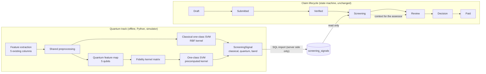
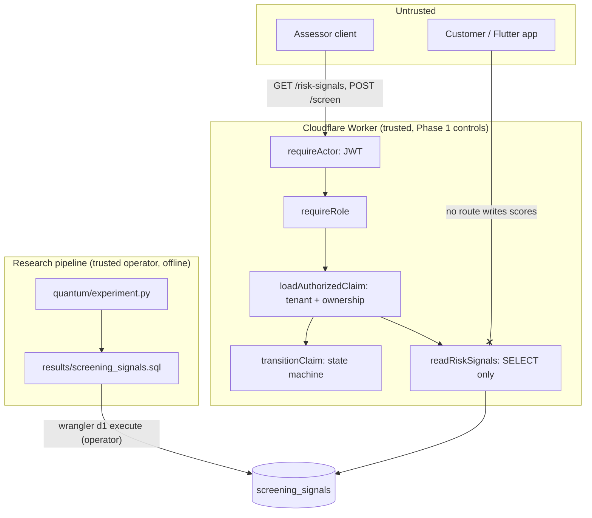

# EasyClaim Quantum Screening Architecture (Phase 4)

Experimental quantum-kernel one-class anomaly signal for the SCREENING stage. Advisory only.
Simulator only. Same features and preprocessing for the classical baseline and the quantum model.

## Where the signal enters the claim lifecycle

The signal is attached to the `POST /screen` response and readable via `GET /risk-signals`. It has no edge into `transitionClaim`, RBAC, tenant checks, evidence or payouts.

## Trust boundary

- Scores enter the database only through an operator-run import. No API route inserts or updates `screening_signals`.
- Every read goes through the same authentication, role, tenant and ownership checks as any other claim route. Cross-tenant → 404, customer → 403, no token → 401.
- Database `CHECK` constraints reject scores outside [0, 1], unknown bands and unknown execution values; the reader treats any malformed row as absent.

## Experiment flow (quantum vs classical)

```mermaid
flowchart LR
  DS[Synthetic dev dataset<br/>120 normal + 16 labelled anomalies<br/>+ 3 seed claims] --> FE[extract_features]
  FE --> PRE[Preprocessor fit on normal rows:<br/>median impute, log1p counts,<br/>min-max, soft clip to 0..1]
  PRE --> X[Scaled matrix X]
  X --> RBF[OneClassSVM rbf, nu 0.1] --> RC[raw classical score]
  X --> ANG[x * pi angles] --> FM[U x : H, RZ x_i, CNOT RZ x_i x_j / pi CNOT, 2 reps] --> ST[statevectors] --> K[K = abs inner product squared]
  K --> VAL[validate: symmetric, diag 1, PSD] --> OC[OneClassSVM precomputed, nu 0.1] --> RQ[raw quantum score]
  RC --> PCT[percentile vs reference] --> BAND[NORMAL / UNUSUAL / HIGH_ANOMALY]
  RQ --> PCT
```

## Attack → control → expected result

| Attack | Control | Expected |
|---|---|---|
| Client posts `{"quantumAnomaly": 0.01}` to make a claim look normal | No write route; `/screen` ignores bodies; customer schemas are `.strict()` | table unchanged; `400` on the customer form |
| Assessor of tenant B reads tenant A's signal | `loadAuthorizedClaim('insurer')` tenant boundary | `404` |
| Customer reads their own signal | `requireRole(ASSESSOR, MANAGER)` | `403` (DECISION REQUIRED whether a customer view is ever added) |
| Operator imports a row with score 1.5 or band `FRAUD` | SQL `CHECK` constraints | insert rejected |
| Signal for a non-existent claim | `REFERENCES claims(id)` | insert rejected |
| A `HIGH_ANOMALY` row is inserted for a claim | no code path reads the signal before or inside `transitionClaim` | `claims` row identical before and after |

## Data flow

Enters: claim rows (id, user_id, category, cause_of_loss, incident_date, created_at). Changes: features → scaled → angles → statevector → kernel → score → band. Stores: one row per claim in `screening_signals` (scores, band, model version, execution, JSON feature snapshot, timestamp). Exits: `riskSignals` object in `POST /screen` and `GET /risk-signals`, insurer-only, with an explanation string that never says "fraud".

## Demo flow

1. `npm run db:migrate:local && npm run db:seed:local && npm run signals:import:local && npm run demo:quantum:local`
2. `npm run dev -- --port 8789`, mint an ASSESSOR token for `ins_discovery` (`npm run token`).
3. DEMO 1: `POST /api/v1/claims/claim_demo_normal/screen` → `riskSignals.interpretation = NORMAL`.
4. DEMO 2: `POST /api/v1/claims/claim_demo_unusual/screen` → `HIGH_ANOMALY`, explanation suggests human review; then `POST /review` still needs the assessor.
5. DEMO 3: open `quantum/results/results.md` — classical vs quantum on identical features, including where they disagree.
